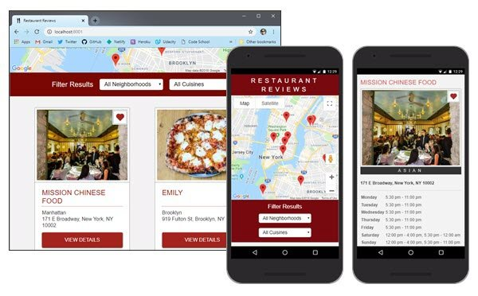

# Restaurant Review App

<!-- [](https://forthebadge.com) [](https://forthebadge.com) -->



This is a proof-of-concept Progressive Web App. It served as my capstone project for Udacity's Mobile Web Specialist Nanodegree. It was forked from a static master/detail page starter project provided by Udacity.

I documented all my code changes and posted the final working app using Netlify's CI/CD build system.

- See [Live Demo](https://restaurant-review-app.netlify.com) of the Restaurant Review App
- See [Code Notes](https://james-priest.github.io/mws-restaurant-stage-1/) with screenshots and a breakdown of what the app does and how it was built.

## Branches

This repo is split into the following branches based on the client app's phase of development.

- **stage-1** takes a broken and static web page and makes it a fully responsive and accessible progressive web app. It's launched using a simple http server.
- **stage-2** uses Cache API & IndexedDB to make the site available offline. It includes a build system that automatically serves the optimized site. (Must be run along side the [mws-stage-restaurant-stage-2](https://github.com/james-priest/mws-restaurant-stage-2)  back end data server).
- **stage-3** adds HTML5 forms & expands offline capability to include data manipulation. Also includes a build system to serve the optimized site. (Must be run along side the [mws-restaurant-stage-3](https://github.com/james-priest/mws-restaurant-stage-3) back end data server).
- **stage-4** updates the app to work with a hosted NoSQLDB and RESTful API. A [restdb.io](https://restdb.io) database must be created following the specs in [Code Notes: Stage 4](https://james-priest.github.io/mws-restaurant-stage-1/stage4.html).
- **master** is the production branch used by the build system (currently sync'd to **stage-4** branch).

## Installation

These are installation instructions for stage-4. To run any of the other stages, switch to that branch and follow the instructions in this README.

Two things must happen to run this project:

1. An `.env` file must be created in the root containing a valid Google Maps API key and RestDB CORS API key.
2. The Gulp build system must be run which will serve the optimized site.

### API Keys

A file named `.env` needs to be created in the root folder (`\`) with a valid Google Maps API key and a valid RestDB CORS API key.

```text
GM_API_KEY=<key goes here>
RESTDB_API_KEY=<key goes here>
```

## Usage
You can do one of three things.

- Start a dev server
- Run a production build
- Serve a production build


<!-- ### Development Build with Server -->
### Start a dev server

If you want a development server that will reload with BrowserSync you can use the following commands.

<!-- #### Start the dev server -->

```bash
gulp serve
```

This will start the server at `http://localhost:8001`.

Changes can be made to the files in the `app/` directory. The browser will reload the changes on each file save.

### Production build

```bash
gulp
```

This will build and optimize the project ready for deployment. It will output to the `dist/` folder.

<!-- ### Production Build with Server -->
### Serve a production build

If you want to test an optimized production build you can run the following command.

<!-- #### Serve a production build -->

```bash
gulp serve:dist
```

This will start the server at `http://localhost:8000`.
