<!-- markdownlint-disable MD022 MD024 MD032 -->
# Code Log

These notes chronicle the following:
- Administrative prep & set-up
- Making the Restaurant Review App fully responsive
- Writing code required to meet that objective
- Making any other additions necessary to meet the [project specifications](https://review.udacity.com/#!/rubrics/1090/view)

## 1. Prep
### 1.1 Local Setup
In preparation to complete stage one of this project, I had to do the following:

1. Fork and clone the [starter repository](https://github.com/udacity/mws-restaurant-stage-1).
2. Get my own [Google Maps API key](https://developers.google.com/maps/documentation/javascript/get-api-key).
3. Get an http server going on localhost. I used [http-server](https://www.npmjs.com/package/http-server), a node-based command-line http-server.

### 1.2 Set up Jekyll
This is done so I could turn my markdown notes into a statically generated website. This Jekyll setup is the same one used by GitHub Pages to generate the site on their servers once I push my Markdown notes and enable the feature on the repository.

I followed these steps to get a version of the Jekyll build system running locally.

1. Create a 'docs/' folder off my repo root.
2. Add a 'README.md' to the 'docs/' folder.
3. `git commit...` & `git push` to update the repo on GitHub.
4. On GitHub, go to your repo's Settings -> GitHubPages -> Theme Chooser. I chose the "Leap Day" theme.
5. On GitHub, under Settings -> GitHubPages -> Source, choose '**master branch /docs folder**' & hit Save.
6. This adds a new commit on GitHub so you need to do a `git pull` to get the latest changes locally.
7. Copy any customized files from the jekyll template (Leap Year theme in this case) into this repo. I have quite a few customized files, so this includes the following folders that are copied into 'docs/':
    - '_layouts/'
    - 'assets/css/'
    - 'assets/images/'
    - 'assets/js/'

### 1.3 Set up Grunt
This is done so that I can automate the process of compressing screen captured images for these notes. I followed the instructions in this post
- [Generate multi-resolution images for srcset with Grunt](https://addyosmani.com/blog/generate-multi-resolution-images-for-srcset-with-grunt/)

to create a Gruntfile.js to work with my setup.

Here's what I did
1. Create a 'docs/src/images/' folder to contain all original JPGs.
2. Created a packages.json under 'docs/'. Steps to do so are in [Grunt Getting Started](https://gruntjs.com/getting-started).
3. Created my Gruntfile.js.
4. Run `npm install`.
5. Run `grunt`.

#### package.json

```json
{
  "name": "mws-restaurant-stage-1-grunt",
  "version": "0.1.0",
  "description": "grunt task for creating multi-sized responsive images",
  "main": "main.js",
  "scripts": {
    "test": "echo \"Error: no test specified\" && exit 1"
  ,
  "repository": {
    "type": "git",
    "url": "https://github.com/james-priest/mws-restaurant-stage-1.git"
  },
  "author": "James Priest",
  "license": "ISC",
  "devDependencies": {
    "grunt": "^1.0.2",
    "grunt-contrib-clean": "^1.1.0",
    "grunt-contrib-watch": "^1.1.0",
    "grunt-responsive-images": "^1.10.1"
  }
}
```

#### Gruntfile.js

 ```js
responsive_images: {
  dev: {
    options: {
      sizes: [
        {
          width: 800,
          quality: 85,
          rename: false
        },
        {
          name: 'small',
          width: 570,
          quality: 85
        }
      ]
    },
    files: [{
      expand: true,
      cwd: 'src/images/',
      src: ['*.{jpg,png}'],
      dest: 'assets/images/'
    }]
  }
},
watch: {
  dev: {
    files: ['src/images/*.{jpg,png}'],
    tasks: ['responsive_images']
  }
}
```

## 2. Normalize Layout

### 2.1 Starting the http-server
I then fired up the server to look at the site in its current state.

```bash
http-server . -p 8000
```

### 2.2 View original site
Here are some screen grabs of the site without as it looked "out-of-the-box".

#### BEFORE
[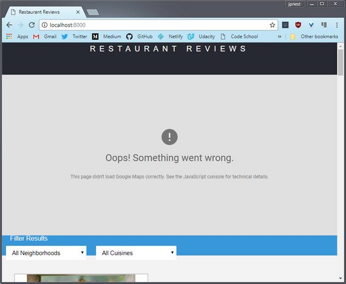](assets/images/1.jpg)
**Figure 1:** Homepage map

[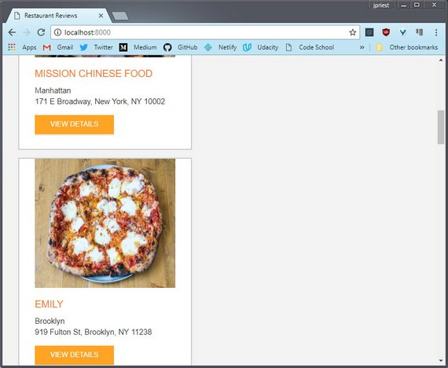](assets/images/2.jpg)
**Figure 2:** Homepage restaurants

[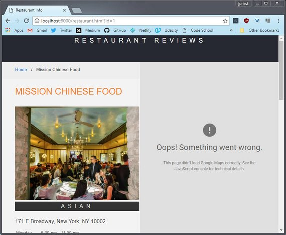](assets/images/3.jpg)
**Figure 3:** Detail restaurant page: map & image

[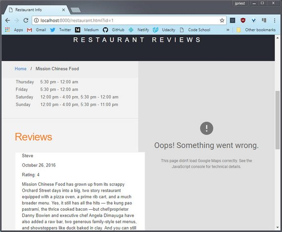](assets/images/4.jpg)
**Figure 4:** Detail restaurant page: reviews

### 2.3 First set of changes
Here are the steps I applies

1. Added UTF meta tag to both index.html & restaurant.html
    ```html
    <meta charset="UTF-8">
    ```
2. Added viewport meta tag to both index.html & restaurant.html
    ```html
    <meta name="viewport" content="width=device-width, initial-scale=1.0">
    ```
3. Increased default `font-size` to `16px` for small displays
    ```css
    /* font-family: Arial, Helvetica, sans-serif; */
    /* font-size: 10pt; */
    /* line-height: 1.5; */
    body,td,th,p {
      font: 16px/1.6 Arial, Helvetica, sans-serif;
    }
    ```
4. Commented out all unnecessary css style rules in 'styles.css'. This included
    - Hardcoded `width` settings on various elements
    - Hardcoded `font-size` settings on various elements
    - Unnecessary `margin` or `padding`
    - Unnecessary `position: fixed` and `position: absolute`
5. Added `display: grid` and `display: flexbox` for content centering
    - Header nav
    - Restaurant list
6. Went back and set `width: 100%` so elements would fill available space.

### 2.4 View new flow layout

#### AFTER HTML & CSS UPDATES
[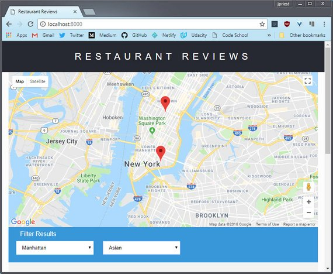](assets/images/5.jpg)
**Figure 5:** Homepage map with flow layout

[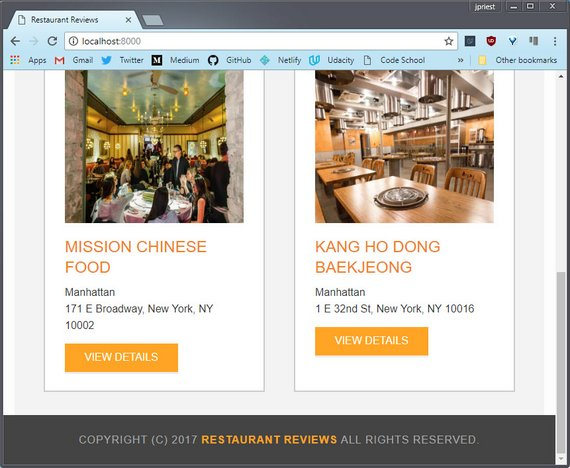](assets/images/6.jpg)
**Figure 6:** Homepage restaurants with flow layout

[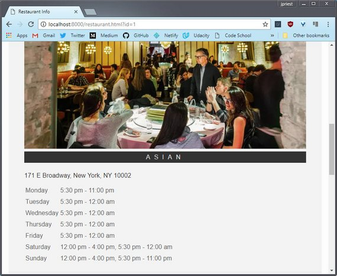](assets/images/7.jpg)
**Figure 7:** Detail restaurant page: map & image with flow layout

[](assets/images/8.jpg)
**Figure 8:** Detail restaurant page: reviews with flow layout

## 3. Responsive Design
### 3.1 Open DevTools
Starting small, I created various breakpoints according to where the layout naturally needed it. Here are the steps I followed:

Opened up DevTools and made the viewport somewhat small to see how it would affect the site.

[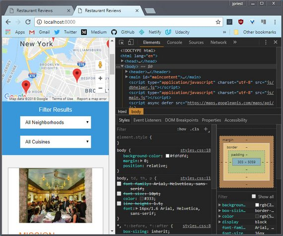](assets/images/9.jpg)
**Figure 9:** Homepage: DevTools open to smallest viewport

### 3.2 Toggle Device Toolbar
Then I toggled on the device toolbar. From here I could set various viewport widths.

I was also able to see my media queries and adjust various style settings from DevTools as I stretch and shrunk the viewport.

[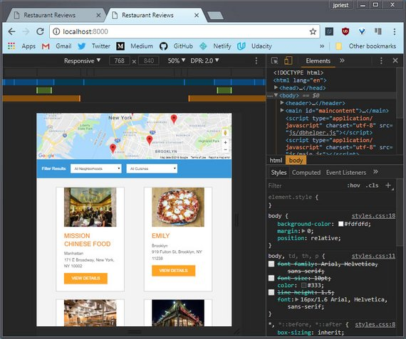](assets/images/10.jpg)
**Figure 10:** Homepage: DevTools with device toolbar

### 3.2 Determine Breakpoints
I started small and worked my was up, making sure each breakpoint transitioned smoothly to the next.

Each successful change in DevTools was reflected in the stylesheet I had open in my code editor.

When I was done I ended up with a site that looked great across viewport sizes.

[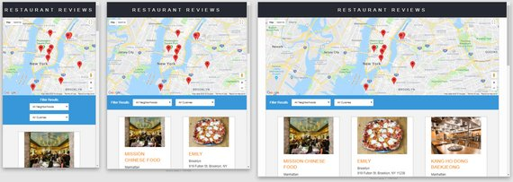](assets/images/11.jpg)
**Figure 11:** Homepage across multiple device display sizes

[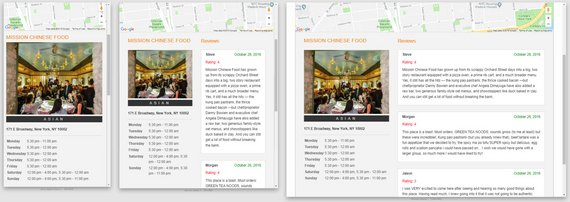](assets/images/12.jpg)
**Figure 12:** Detail page across multiple device display sizes

## 4. Responsive Images
### 4.1 Determine image sizes
The first step was to go through my now wonderfully responsive site and determine the various sizes I need to target for each image at various viewport sizes.

[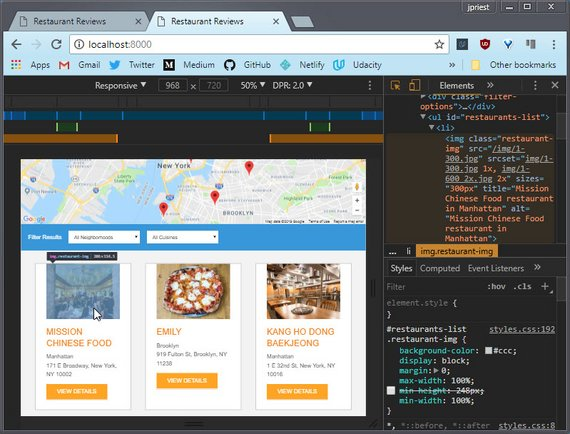](assets/images/13.jpg)
**Figure 13:** Homepage with image selected

I settled on the following.

- 300px
- 400px
- 600px (2x device pixel density)
- 800px (2x dpp)

Currently all images are sized at 800x600 pixels.

### 4.2 Setup Grunt
Next I had to set Grunt up to do the responsive image compression.

Here's the important part of the Gruntfile.js config I created.

```js
      responsive_images: {
        dev: {
          options: {
            engine: 'gm',
            sizes: [
              {
                width: 300,
                quality: 60
              },
              {
                width: 400,
                quality: 60
              },
              {
                width: 600,
                quality: 60,
                suffix: '_2x'
              },
              {
                width: 800,
                quality: 60,
                suffix: '_2x'
              }
            ]
          },
          files: [{
            expand: true,
            cwd: 'img_src/',
            src: ['*.{gif,jpg,png}'],
            dest: 'img/'
          }]
        }
      }
```

Given '1.jpg', this creates the following set of compressions for each image:

- 1-300.jpg
- 1-400.jpg
- 1-600_2x.jpg
- 1-800_2x.jpg

### 4.3 Update the data
The next step was to update the data. In this case, the restaurants.json file. It contains all the relevant restaurant data. I added in `srcset` info for each restaurant image.

```json
 "restaurants": [{
    "id": 1,
    "name": "Mission Chinese Food",
    "neighborhood": "Manhattan",
    "photograph": "1-300.jpg",
    "srcset_index": "img/1-300.jpg 1x, img/1-600_2x.jpg 2x",
    "srcset_restaurant": "img/1-300.jpg 300w, img/1-400.jpg 400w,
                          img/1-600_2x.jpg 600w, img/1-800_2x.jpg 800w",
    "address": "171 E Broadway, New York, NY 10002",
    "latlng": {
      "lat": 40.713829,
      "lng": -73.989667
    },
```

Here I chose to use Pixel Density Descriptor (1x, 2x, 3x) syntax for the index page's srcset and image size for the restaurant detail page srcset.

### 4.4 Update the code
The next step was to update the code so that it pulled the data from the database (json) and used it to properly update the html output.

DB Helper.js has helper methods to format the data. Currently we are not formatting the return data but it's wrapped in template literals in order to allow this in the future.

dbhelper.js

```js
 /**
   * Index image Srcset.
   */
  static imageSrcsetForIndex(restaurant) {
    return (`${restaurant.srcset_index}`);
  }

  /**
   * Restaurant image Srcset.
   */
  static imageSrcsetForRestaurant(restaurant) {
    return (`${restaurant.srcset_restaurant}`);
  }
```

restaurant_info.js

```js
// detail page
fillRestaurantHTML = (restaurant = self.restaurant) => {
  const name = document.getElementById('restaurant-name');
  name.innerHTML = restaurant.name;

  const address = document.getElementById('restaurant-address');
  address.innerHTML = restaurant.address;

  const image = document.getElementById('restaurant-img');
  image.className = 'restaurant-img'
  image.src = DBHelper.imageUrlForRestaurant(restaurant);
  image.srcset = DBHelper.imageSrcsetForRestaurant(restaurant);
  image.sizes = "(max-width: 320px) 300px, (max-width: 425px) 400px,
                 (max-width: 635px) 600px, (min-width: 636px) 400px";
  ...
}
```

main.js

```js
// index page
createRestaurantHTML = (restaurant) => {
  const li = document.createElement('li');

  const image = document.createElement('img');
  image.className = 'restaurant-img';
  image.src = DBHelper.imageUrlForRestaurant(restaurant);
  image.srcset = DBHelper.imageSrcsetForIndex(restaurant);
  image.sizes = "300px";
```

Here I could have pulled the sizes data from the json file but since this data won't be changing from image to image, I decided to just hard code it here.

The final result is shown here.

[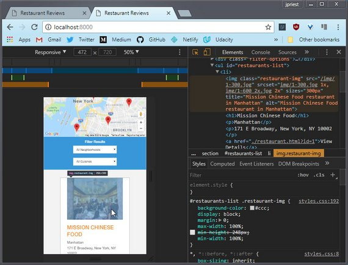](assets/images/14.jpg)
**Figure 14:** Homepage with image srcset & sizes attributes