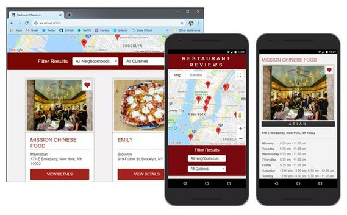
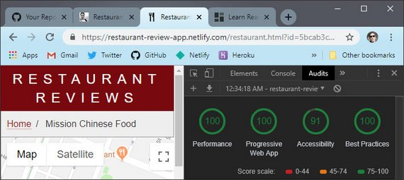
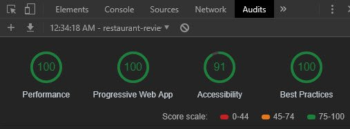

<!-- markdownlint-disable MD022 MD024 MD032 -->
# Code Notes

These notes detail the solutions applied toward solving each stage of the Restaurant Review App project.

- [Stage 1](stage1.html) - Make the app fully responsive & fully accessible
- [Stage 2](stage2.html) - Use Cache API & IndexedDB to make the site available offline
- [Stage 3](stage3.html) - Add HTML forms & expand offline to include data manipulation
- [Stage 4](stage4.html) - Setup hosted NoSQL DB with RESTful API and update client to use it

### Project Overview
This app was my capstone project for Udacity's Mobile Web Dev Nanodegree.

The project required that we code against various HTML5 APIs with vanilla Javascript. We were not to use the assistance of any frameworks or external libraries except for a Promise library that wrapped the IndexedDB API.

Here's a high level list of some of the functionality this app needed to produce.

- Asynchronous requests (Ajax)
- Offline-first capability
- Fully Responsive Design
- ARIA compliant, Accessible, and Screen Reader/Assistive Technology capable
- Highly optimized & performant (90+ Audit metrics for Performance, Accessibility, Best Practices, PWA)

Here's a partial list of the APIs and technologies we needed use and demonstrate.

- Service Worker
- Cache API
- JavaScript Promises
- ES 2015 Syntax (arrow functions, destructuring, sting literals, sets, etc.)
- Fetch API
- Web Workers
- Build systems (Grunt, Gulp, BrowserSync, Babel, etc.)
- Progressive Web App features (Service Worker, App Manifest, caching, etc.)

### Audit Scores

### Live Demo & GitHub Repo

- [Live Demo](https://restaurant-review-app.netlify.com)
- [GitHub Repo](https://github.com/james-priest/mws-restaurant-stage-1)