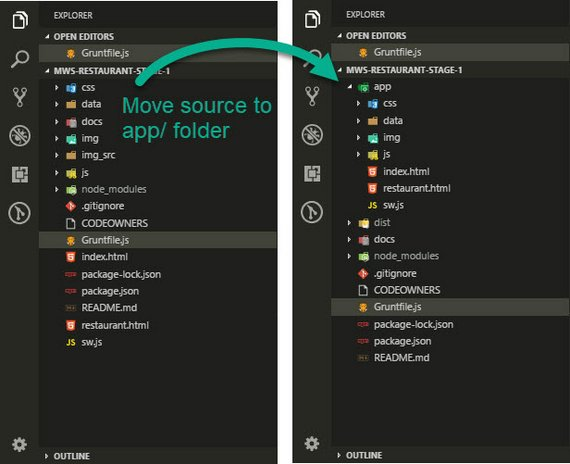

<!-- markdownlint-disable MD022 MD032 -->
# Code Notes

[<-- back to Restaurant Review Code Notes homepage](index.html)

---

Here are the requirements for Stage 2:
- Pull data through Ajax (Fetch API) from a live data source
- Cache the JSON response data on the client with IndexedDB for offline access
- Create a build system with Grunt, Gulp, Webpack, or Parcel
- Ensure Lighthouse performance benchmarks meet the following:
  - **Progressive Web App** - 90 or better
  - **Performance** - 70 or better
  - **Accessibility** - 90 or better

## 1. Stage 2 Prep
### 1.1 Fork & Clone Repo
The first thing to do was fork the [mws-restaurant-stage-2](https://github.com/udacity/mws-restaurant-stage-2) starter project.

This is a Local Development API Server and will not be the project we'll be working on. Instead, we spin this server up and continue extending the  work on our stage-1 project.

- Stage-1 consists of the front-end
- Stage-2 is a back end dev server that provides the API services our app will consume

### 1.2 Install Dependencies
Read README.md. It describes the following steps to install all npm dependencies and spin up the server.

#### Install Global Dependencies
From the command line enter the following.

```bash
npm install sails -g
```

#### Install Project Dependencies
Next install all project dependencies. This will install all packages that are detailed in the `packages.json` project file.

```bash
npm install
```

### 1.3 Start Server
You can then start the server with the following command.

```bash
node server
```

## 2. Ajax with Fetch
### 2.1 API Usage
The API can be tested in a few different ways. Here's what the README shows in terms of usage.

#### Usage
##### Get Restaurants

```bash
curl "http://localhost:1337/restaurants/"
```

##### Get Restaurants by id

```bash
curl "http://localhost:1337/restaurants/{3}"
```

### 2.2 Test API
There are a few different ways to test whether the API is working properly.

You can use
- Browser URL
- Fetch in Console
- Ajax Test App

### 2.3. Test API: Browser
A quick and dirty way to test is to copy the url into the url bar of your browser.

[](assets/images/2-1.jpg)
**Figure 1:** Browser URL

### 2.4. Test API: DevTools
You can also write a `fetch` request right in the console of your browser.

[](assets/images/2-2.jpg)
**Figure 2:** DevTools Fetch Call

You might have to use `<SHIFT>` + `<ENTER>` in order to skip lines without submitting the code.

What is initially returned is a Promise in *pending* state. Once the promise resolves the results should output to the console immediately afterwards.

You'll need to click the arrow to expand the array.

> **NOTE:** For security reasons you can only `fetch` from the same domain. Meaning you can't fetch data from `http://unsplash.com` if you are on `http://google.com`.
>
> Also note that if the Promise does not resolve with output to the console, you may need to refresh the page and try again.

[](assets/images/2-3.jpg)
**Figure 3:** DevTools Fetch Results

Here is the fetch code.

```js
fetch('http://localhost:1337/restaurants')
  .then(r => r.json())
  .then(data => console.log(data))
  .catch(e => console.log("Booo"))
```

### 2.5. Test API: Ajax App
You can use an app like Postman to really test all permutations of an Ajax call.

This is a good option if need to really test and understand what is returned in a complex Web API.

Here is the output of a restaurant call

[](assets/images/2-4.jpg)
**Figure 4:** Postman App

The advantage of an app like this is

1. You don't need to write complex code in the console to make it work. Just submit your fetch string as the request
2. The response is color coded and easier to read than browser output.

## 3. Change Folder structure
This was done to prep my code so it would fit into a more traditional build process.

This is one in which source files from one directory are transformed and copied to a working or distribution directory.

### 3.1 Organization Benefits
The next step I took was to organize my code into a build folder structure. This does the following.

- Cleans the clutter out of the project root
- Sets the folder where my source code goes to use as part of my build process (`/src/` or `app/`)
- Allows me to set a `tmp/` folder where code will be copied and served by a dev server after it's processed
- Allows me to set a `dist/` folder for minified code

### 3.2 New Folder Structure
I decided to put all source files into an `app/` folder. From there I can have my Grunt or Gulp tasks process those files and place the transpiled and minified code into a `dist/` folder.

[](assets/images/2-5.jpg)
**Figure 5:** New Folder Structure

### 3.3 Update .gitignore
Along with the folder structure changes, I made an update to my `.gitignore` file.

```bash
# build, dist, & tmp directories
build/
dist/
tmp/
```

This prevents build or output folders from being copied to GitHub which is unnecessary since those folders (and files) will be created when the build tasks are run.

## 4. Fix Gruntfile
Changing the folder structure broke my old Grunt tasks. I wanted to fix that before moving on to Gulp.

### 4.1 My Original Build
In Stage 1, Grunt was designed to only to create a set of responsive images. This consisted of the following tasks:

- `clean` - Delete everything from the `img/` directory
- `responsive_images` - Take each image in `img_src/`, process at different resolutions (300, 400, 600, 800), and save to `img/` folder.

### 4.2 Copy Task
Since the files will be served from a new folder, I had to copy all non-processed files to the `dist/` folder.

This required a `copy` task to move css, js, & unprocessed image files.

```js
copy: {
  dev: {
    files: [
      { expand: true, cwd: 'app/', src: ['sw.js'], dest: 'dist/'},
      { expand: true, cwd: 'app/', src: ['css/*'], dest: 'dist/' },
      { expand: true, cwd: 'app/', src: ['js/*'], dest: 'dist/'},
      { expand: true, cwd: 'app/', src: ['img/fixed/*'], dest: 'dist/' }
    ]
  }
},
```

### 4.3 String Replace Task
Next, I moved my Google Maps API key out of my HTML files so it won't be visible, stolen, or used by someone else browsing my source code on GitHub.

I moved it to a file named `GM_API_KEY` and placed that file at the project root. I also updated `.gitignore` with this filename so it wouldn't be copied to GitHub.

```bash
# Google Maps API key
GM_API_KEY
```

Next, I added this task

```js
'string-replace': {
  dist: {
    files: [{
      expand: true, cwd: 'app/', src: ['*.html'], dest: 'dist/'
    }],
    options: {
      replacements: [{
        pattern: '<API_KEY_HERE>',
        replacement: '<%= grunt.file.read("GM_API_KEY") %>'
      }]
    }
  }
},
```

It looks in the `app/` folder for any HTML files and replaces `<API_KEY_HERE>` with the actual key value and then copies that to the `dist/` folder.

### 4.4 Final Gruntfile
The last steps were to update the existing `clean` and `responsive-images` tasks to use the new directory structure.

Here's the final `Gruntfile.js` configuration.

```js
module.exports = function(grunt) {

  grunt.initConfig({
    clean: {
      dev: {
        src: ['dist/*'],
      }
    },
    copy: {
      dev: {
        files: [
          { expand: true, cwd: 'app/', src: ['sw.js'], dest: 'dist/'},
          { expand: true, cwd: 'app/', src: ['css/*'], dest: 'dist/' },
          { expand: true, cwd: 'app/', src: ['js/*'], dest: 'dist/'},
          { expand: true, cwd: 'app/', src: ['img/fixed/*'], dest: 'dist/' }
        ]
      }
    },
    'string-replace': {
      dist: {
        files: [{
          expand: true, cwd: 'app/', src: ['*.html'], dest: 'dist/'
        }],
        options: {
          replacements: [{
            pattern: '<API_KEY_HERE>',
            replacement: '<%= grunt.file.read("GM_API_KEY") %>'
          }]
        }
      }
    },
    responsive_images: {
      dev: {
        options: {
          engine: 'gm',
          sizes: [
            {
              width: 300,
              quality: 40
            },
            {
              width: 400,
              quality: 40
            },
            {
              width: 600,
              quality: 40,
              suffix: '_2x'
            },
            {
              width: 800,
              quality: 40,
              suffix: '_2x'
            }
          ]
        },
        files: [{
          expand: true,
          cwd: 'app/img/',
          src: ['*.{gif,jpg,png}'],
          dest: 'dist/img/'
        }]
      }
    }
  });

  grunt.loadNpmTasks('grunt-contrib-clean');
  grunt.loadNpmTasks('grunt-contrib-copy');
  grunt.loadNpmTasks('grunt-string-replace');
  grunt.loadNpmTasks('grunt-responsive-images');
  
  grunt.registerTask('quick', ['copy', 'string-replace']);

  grunt.registerTask('default', ['clean', 'copy', 'string-replace',
    'responsive_images']);
};
  
```

## 5. Evaluate Build Tools
Before committing myself to one tool or another, I figured I should spend the time researching and evaluating what's available.

### 5.1 Old School Task Runners
There are a handful of build tools out there for web dev now. The original web dev build tools were referred to as Task Runners.

These became popular around 2014 and are still in wide use today. The the two with majority market share were Grunt and Gulp.

- [Grunt](https://gruntjs.com/) - Configuration-based task runner (simpler to config; more verbose)
- [Gulp](https://gulpjs.com/) - Code-based task runner (steeper learning, more condensed, faster exec)

### 5.2 Modern Bundlers
The next generation of web dev build tools were referred to as Bundlers. These do the same set of tasks as the Grunt and Gulp but are more streamlined for today's JavaScript frameworks.

Webpack is now the standard web dev/JavaScript bundler and is primarily used by the React team amongst others. The downside to webpack is complaints about it's documentation.

Parcel is quickly gaining attention for providing out of the box bundling with zero config.

- [Webpack](https://webpack.js.org) - Standard use in the big frameworks - React, Angular, Vue
- [Parcel](https://parceljs.org/) - Uses best practices for transforms, bundling, & code splitting
  
### 5.3 Conclusion
In the end I decided to go with Gulp since the [Web Tooling and Automation](https://www.udacity.com/course/web-tooling-automation--ud892) course associated with this nanodegree teaches that build system.

I figure whatever concepts I learn there are applicable to modern tools like Webpack and Parcel. It's like learning long division before working with a calculator.

## 6. Using Gulp
Settling on Gulp, I now had the choice of either using a scaffolding system or rolling my own gulpfile.

### 6.1 Scaffolding Options
The first thing I did was investigate scaffolding options.

Scaffolding is basically code generation. It consists of either using a pre-built code solution or using a generator that creates a baseline set of code files for use as a starting point.

It's a quick way to kickstart a project that conforms to a set of best practices.

The options I looked at were

- [Yeoman](http://yeoman.io)'s [Webapp generator](https://github.com/yeoman/generator-webapp)
- Google's [Web Starter Kit](https://developers.google.com/web/tools/starter-kit/)

These are great resources but I'm always hesitant to rely on generated code. 

The reason is that while generated code is quick and insulates you from having to understand the inner workings up front, it can quickly become a coding nightmare if you need to deviate from the norm.

If I need to customize the functionality then I usually lose any time saving benefits because I end up having to learn how to do it all anyways.

That said, a generated or pre-built solution is good to follow because chances are will use best coding practices & conventions.

In the end, I decided to roll up my sleeves and roll my own build solution.

I was able to use the gulpfile's & package.json's from Yeoman & Web Starter Kit as references though.

> #### Yeoman webapp generator
> - [gulpfile.js](https://github.com/yeoman/generator-webapp/blob/master/app/templates/gulpfile.js)
> - [ package.json](https://github.com/yeoman/generator-webapp/blob/master/app/templates/_package.json)
>
> #### Google Web Starter Kit
> - [gulpfile.js](https://github.com/yeoman/generator-webapp/blob/master/app/templates/gulpfile.js)
> - [package.json](https://github.com/google/web-starter-kit/blob/master/package.json)

### 6.2 Gulp Prep
The first thing I did was read through the following articles to get a sense of how tasks are constructed.

1. [Getting Started with Gulp](https://travismaynard.com/writing/getting-started-with-gulp)
2. [Gulp for Beginners](https://css-tricks.com/gulp-for-beginners/)
3. [How to automate all things with gulp](https://hackernoon.com/how-to-automate-all-the-things-with-gulp-b21a3fc96885)

The article that really stood out was #3 [How to automate all things with gulp](https://hackernoon.com/how-to-automate-all-the-things-with-gulp-b21a3fc96885).

This article walks you through creating a build process from start to finish. It also details a basic folder structure strategy using the following folders.

- `src/` or `app/` - source code
- `tmp/` - working dir from which a dev server will serve the linted & bundled files
- `dist/` - production ready & minified bits

### 6.3 Basic config
Following the same article [How to automate all things with gulp](https://hackernoon.com/how-to-automate-all-the-things-with-gulp-b21a3fc96885), I proceeded to create a basic configuration.

This does the following

- defines `src/`, `tmp/`, & `dist/` paths
- creates `clean`, `copy`, `build`, `serve`, & `watch` tasks

The complete gulpfile is below.

```js
var gulp = require('gulp');
var del = require('del');
var fs = require('fs');
var replace = require('gulp-string-replace');
var browserSync = require('browser-sync').create();

var paths = {
  src: 'app/**/*',
  srcHTML: 'app/**/*.html',
  srcCSS: 'app/**/*.css',
  srcJS: 'app/**/*.js',

  tmp: 'tmp', // tmp folder
  tmpIndex: 'tmp/index.html', // index.html in tmp folder
  tmpCSS: 'tmp/**/*.css', // css files in tmp folder
  tmpJS: 'tmp/**/*.js', // js files in tmp folder

  dist: 'dist',
  distIndex: 'dist/index.html',
  distCSS: 'dist/**/*.css',
  distJS: 'dist/**/*.js'
};

// build
gulp.task('default', ['copy', 'js']);

// serve & watch
gulp.task('serve', function () {
  browserSync.init({
    server: paths.tmp,
    port: 8000
  });
  
  gulp.watch(paths.srcJS, ['js-watch']);
});

// build, serve, & watch
gulp.task('serve:build', ['copy', 'js', 'serve']);

// this task ensures the `js` task is complete before reloading browsers
gulp.task('js-watch', ['js'], function (done) {
  browserSync.reload();
  done();
});

// Clean output directory
gulp.task('clean', function () {
  del(['tmp/*', 'dist/*']); // del files rather than dirs to avoid error
});

// HTML
gulp.task('html', function () {
  var apiKey = fs.readFileSync('GM_API_KEY', 'utf8');

  return gulp.src(paths.srcHTML)
    .pipe(replace('<API_KEY_HERE>', apiKey))
    .pipe(gulp.dest(paths.tmp));
});
// CSS
gulp.task('css', function () {
  return gulp.src(paths.srcCSS)
    .pipe(gulp.dest(paths.tmp));
});
// JS
gulp.task('js', function () {
  return gulp.src(paths.srcJS)
    .pipe(gulp.dest(paths.tmp));
});

gulp.task('copy', ['html', 'css', 'js']);
```

I can now do the following.

- `gulp` - default task that builds the site: code is placed in `tmp/`
- `gulp serve` - spins up the dev server and watches for changes to `.js` files
- `gulp serve:build` - combines previous two tasks; builds the site & serves it

[](assets/images/2-6.jpg)
**Figure 6:** Gulp Build

### 6.4 Lint & Transpile
Now that the basics of my build system were in place, I expanded the scope of my tasks.

To begin with I wanted to lint my code on every build to eliminate syntax errors and enforce best coding practices. This was done with a set of linting rules I defined.

Next, I wanted to make sure my ES6 code runs across all major browsers. This is done through a transpiler and a set of rules defining which browsers I'm targeting.

I used ESLint for linting and Babel for transpiling.

> #### Lint & Transpile Tools
> - [Babel](https://babeljs.io/docs/en) - is a JavaScript compiler used to convert code into a backwards compatible version of JavaScript for old browsers or environments.
> - [ESLint](https://eslint.org/docs/user-guide/getting-started) - provides static analysis of JavaScript used to find syntax errors, problematic patterns, or code that doesn’t adhere to certain style guidelines.

#### Install Packages
The first thing I did was install the necessary packages.

```bash
npm install gulp-eslint gulp-babel babel-core babel-preset-env --save-dev
```

Here's what each do.

- `gulp-eslint` - gulp plugin version of ESLint
- `gulp-babel` - gulp plugin version of Babel
- `babel-core` - core engine
- `babel-preset-env` - set of preset rules

#### Configure ESLint
Next I configured ESLint by answering a set of questions from the command line at my project root with this command.

```bash
eslint --init
```

That produced an `.eslintrc.js` file with some basic configuration. I modified the "rules" section to meet my needs.

```js
module.exports = {
    "env": {
        "browser": true,
        "commonjs": true,
        "es6": true
    },
    "extends": "eslint:recommended",
    // "extends": "google",
    "parserOptions": {
        "sourceType": "module"
    },
    "rules": {
        "indent": [
            "error",
            2
        ],
        // "quotes": 0
        "quotes": [
            "warn",
            "single"
        ],
        "semi": [
            "error",
            "always"
        ],
        "no-console": "off",
        "no-unused-vars": "warn",
        "no-undef": "warn",
        "no-useless-escape": "warn"
    }
};
```

Additional linting rules can be set by looking them up here: [ESLint Rules](https://eslint.org/docs/rules/).

#### Configure Babel
Next, I created a somewhat elaborate `.babelrc` file according to the logic spelled out here: [Three browsers holding JavaScript back the most](https://twitter.com/jamiebuilds/status/1022568918949408768).

I basically states that the default browser list ([http://browserl.ist/?q=defaults](http://browserl.ist/?q=defaults)) supports 89.79% of all browsers with 23 Babel transforms.

The currated browserlist below ([http://browserl.ist/?q=+%3E+0.05%2...](http://browserl.ist/?q=+%3E+0.05%25%2C+not+dead%2C+not+ie+11%2C+not+android+4.1%2C+not+android+4.2%2C+not+android+4.4%2C+not+android+4.4.3%2C+not+chrome+29%2C+not+chrome+43%2C+not+chrome+49%2C+not+chrome+54%2C+not+firefox+47%2C+not+firefox+48%2C+not+firefox+51%2C+not+firefox+52%2C+not+ios+8.1%2C+not+ios+9.3%2C+not+safari+5.1%2C+not+safari+9.1%2C)) supports 88.35% of all browsers while retaining ES6 syntax with only 6 Babel transforms.

```js
{
  "presets": [
    // ["env", {
    //   "targets": {
    //     "browsers": [
    //       "> 2%",  // outputs es5 cause IE11 has 2.71% market share
    //       "not dead"
    //     ]
    //   }
    // }]
    // ["env", {
    //   "targets": {
    //     "browsers": [
    //       "> 3%",  // outputs es6 cause IE11 has 2.71% market share
    //       "not dead"
    //     ]
    //   }
    // }]
    ["env", {
      "targets": {
        "browsers": [
          "> 0.05%",
          "not dead",
          "not ie 11",
          "not android 4.1",
          "not android 4.2",
          "not android 4.4",
          "not android 4.4.3",
          "not chrome 29",
          "not chrome 43",
          "not chrome 49",
          "not chrome 54",
          "not firefox 47",
          "not firefox 48",
          "not firefox 51",
          "not firefox 52",
          "not ios 8.1",
          "not ios 9.3",
          "not safari 5.1",
          "not safari 9.1"
        ]
      }
    }]
  ]
}
```

This matters because transpiled code has a cost.

- More code
- Which is slower to parse
- And slower to execute
- Debugging is harder
- Compiling takes longer
- And all this stacks to transform even more modern features

Here's a link to the [browserlist GitHub Repo](https://github.com/browserslist/browserslist) that explains how to construct the list.

#### Configure Gulp

Then I updated my gulpfile.js with the following.

```js
var babel = require('gulp-babel');
var eslint = require('gulp-eslint');

// JS
gulp.task('js', function () {
  return gulp.src(paths.srcJS)
    .pipe(babel())                  // transpiles js
    .pipe(uglify())                 // minifies js
    .pipe(size({title: 'scripts'})) // outputs file size to console
    .pipe(gulp.dest(paths.tmp));
});
```

I then run gulp with the following command.

```bash
gulp
```

I then get the following output.

[](assets/images/2-7.jpg)
**Figure 6:** Gulp Build

This shows me two things.

- All code warnings associated to linting.
- The final size for scripts at 8.87 kB down from 20.5 kb.

### 6.5 Transform & Bundle
The next thing I had to do was figure out was how to transpile and bundle my JavaScript.

In this case, I had to reference a separate [IndexedDB Promised (idb)](https://github.com/jakearchibald/idb) module in my `sw.js` file.

The `idb` module written by Jake Archibald wraps the browser's native IndexedDB API with Promises to simplify the handling of asynchronous events.

Since this is an external library, we may reference it in one of many ways including AMD, CommonJS, & ES6 modules. For a quick primer read this.

- [A 10 minute primer to JavaScript modules, module formats, module loaders and module bundlers](https://www.jvandemo.com/a-10-minute-primer-to-javascript-modules-module-formats-module-loaders-and-module-bundlers/)

In short, the two most common ways to reference a module or library is with CommonJS (`require` syntax) or ES6 (`import` syntax).

#### ES5 CommonJS syntax (require)

```js
// ES5 CommonJS syntax used in Node.js
let idb = require('idb');
```

#### ES6 modules syntax (import)

```js
// ES6 module format with import syntax
import idb from 'idb';
```

Now in order to have Jake's module bundled with our code we need to rely on a module bundler.

A bundler runs at build time and as the name suggests, it bundles your script files together into one file.

Examples of popular module bundlers are:

- [Browserify](http://browserify.org/): bundler for CommonJS modules
- [Webpack](https://webpack.github.io/): bundler for AMD, CommonJS, ES6 modules

Since we're using Gulp, we will rely on Browserify to do our bundling.

> **NOTE:** When using Webpack or Parcel, the bundling is handled for you in a much simpler and more straightforward way.
>
> For that reason many folks have moved on to use one of those systems.
>
> With Gulp we have to manually configure our bundling with a set of 4-6 plugins to achieve this.

Here's the code so you can see what it looks like. We'll unpack it below.

#### gulpfile.js

```js
var gulp = require('gulp');
var browserify = require('browserify');
var babelify = require('babelify');
var source = require('vinyl-source-stream');
var buffer = require('vinyl-buffer');
var uglify = require('gulp-uglify-es').default; // ES6
var size = require('gulp-size');

var paths = {
  tmp: 'tmp', // tmp folder
}

gulp.task('sw', function () {
  var bundler = browserify('./app/sw.js'); // ['1.js', '2.js']

  return bundler
    .transform(babelify)    // required for ES6 'import' syntax
    .bundle()               // combine code
    .pipe(source('sw.js'))  // get text stream; set destination filename
    .pipe(buffer())         // required to use stream w/ other plugin
    .pipe(uglify())         // condense & minify
    .pipe(size())           // outputs file size to console
    .pipe(gulp.dest(paths.tmp));
});
```

Here we are doing the following:

1. Call `browserify` passing in source JavaScript and assign result to `bundler`
2. Invoke `transform` method passing in `babilify` to transpile ES6 syntax
3. `bundle` combines the code into a single file text stream
4. `source` gets the text stream and emits a single file instance
5. `buffer` converts streaming vinyl file to use buffers for piping to other plugins
6. `uglify` condenses and minifies the JavaScript
7. `size` is unnecessary but nice to see the new file size output to console
8. `gulp.dest` saves the file to the path specified

Here's a list of resources to see other examples.

#### Medium Articles
- [Browserify, Babelify and ES6](http://egorsmirnov.me/2015/05/25/browserify-babelify-and-es6.html)
- [Getting import/export working ES6 style using Browserify + Babelify + Gulp = -5hrs of life](https://medium.com/@hey.aaron/getting-import-export-working-es6-style-using-browserify-babelify-gulp-5hrs-of-life-eca7786e44cc)

#### NPM Packages
- [vinyl-source-stream](https://www.npmjs.com/package/vinyl-source-stream) (with basic example)
- [vinyl-buffer](https://www.npmjs.com/package/vinyl-buffer) (with basic example)

<!-- 
### 6.6 Responsive Images

### 6.7 Concat & Inject -->
