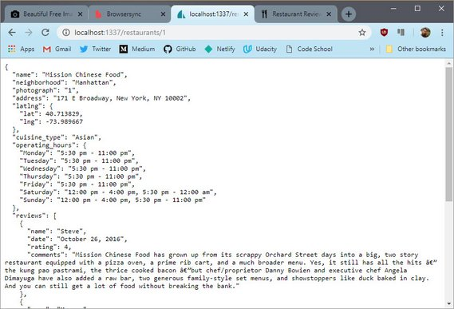
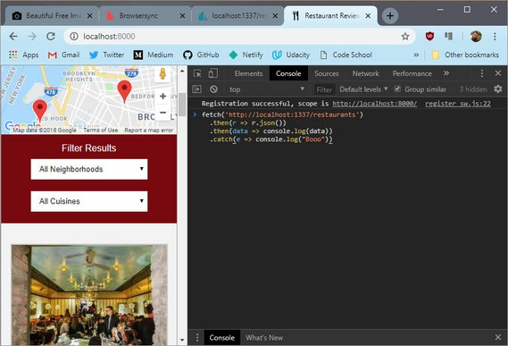
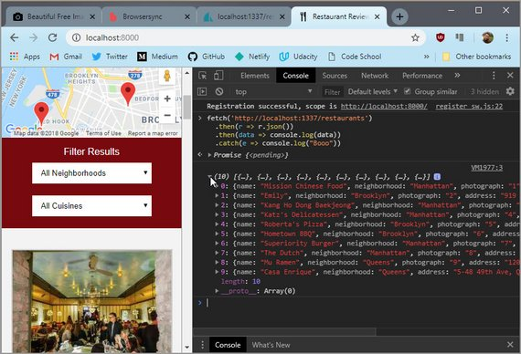
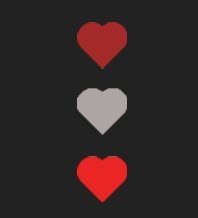

<!-- markdownlint-disable MD022 MD032 -->
# Code Notes

[<-- back to Restaurant Review Code Notes homepage](index.html)

---

### Requirements
Here are the requirements for Stage 3:
- Setup the REST server / review new end points
- Create Favorite toggle control
- Create Review form
- Bind new data to controls
- Cache new data to IDB
- Save review data when offline / Post when back online 
- Ensure Lighthouse performance benchmarks meet the following:
  - **Progressive Web App** - 90 or better
  - **Performance** - 90 or better
  - **Accessibility** - 90 or better

## 1. Stage 3 Prep
### 1.1 Fork & Clone Repo
The first thing to do was fork the [mws-restaurant-stage-3](https://github.com/udacity/mws-restaurant-stage-3) starter project.

This is a Local Development API Server and will not be the project we'll be working on. Instead, we spin this server up and continue extending the  work on our stage-1 project.

- Stage-1 consists of the front-end
- Stage-2 is a back end dev server that provides the API services our app will consume
- Stage-3 is another version of the back end server that provides additional API services for our app to consume

### 1.2 Install Dependencies
Read README.md. It describes the following steps to install all npm dependencies and spin up the server.

#### Install Global Dependencies
This should have been done from stage 2 but if it wasn't then run the command below.

```bash
npm install sails -g
```

#### Install Project Dependencies
Next install all project dependencies. This will install all packages that are detailed in the `packages.json` project file.

```bash
npm install
```

### 1.3 Start Server
You can then start the server with the following command.

```bash
node server
```

## 2. Ajax, Fetch & Endpoints
### 2.0 API Endpoints
View the MWS-Restaurant-Stage-3 [README.md]((https://github.com/james-priest/mws-restaurant-stage-3#endpoints)) in order to see each of the API Endpoints

#### GET Endpoints
- Get all restaurants
  - `http://localhost:1337/restaurants/`
- Get favorite restaurants
  - `http://localhost:1337/restaurants/?is_favorite=true`
- Get a restaurant by id
  - `http://localhost:1337/restaurants/<restaurant_id>`
- Get all reviews for a restaurant
  - `http://localhost:1337/reviews/?restaurant_id=<restaurant_id>`
- Get all restaurant reviews
  - `http://localhost:1337/reviews/`
- Get a restaurant review by id
  - `http://localhost:1337/reviews/<review_id>`

#### POST Endpoints
- Create a new restaurant review
  - `http://localhost:1337/reviews/`
  - Parameters
  ```bash
  {
      "restaurant_id": <restaurant_id>,
      "name": <reviewer_name>,
      "rating": <rating>,
      "comments": <comment_text>
  }
  ```

#### PUT Endpoints
- Favorite a restaurant
  - `http://localhost:1337/restaurants/<restaurant_id>/?is_favorite=true`
- Unfavorite a restaurant
  - `http://localhost:1337/restaurants/<restaurant_id>/?is_favorite=false`
- Update a restaurant review
  - `http://localhost:1337/reviews/<review_id>`
  - Parameters
  ```bash
  {
      "name": <reviewer_name>,
      "rating": <rating>,
      "comments": <comment_text>
  }
  ```

#### DELETE Endpoints
- Delete a restaurant review
  - `http://localhost:1337/reviews/<review_id>`

### 2.1 API Usage
The API can be tested in a few different ways. Here's what the README shows in terms of usage.

#### Usage
##### Get Restaurants

```bash
curl "http://localhost:1337/restaurants/"
```

##### Get Restaurants by id

```bash
curl "http://localhost:1337/restaurants/{3}"
```

### 2.2 Test API
There are a few different ways to test whether the API is working properly.

You can use
- Browser URL
- Fetch in Console
- Ajax Test App

### 2.3. Test API: Browser
A quick and dirty way to test is to copy the url into the url bar of your browser.

[](assets/images/2-1.jpg)
**Figure 1:** Browser URL

### 2.4. Test API: DevTools
You can also write a `fetch` request right in the console of your browser.

[](assets/images/2-2.jpg)
**Figure 2:** DevTools Fetch Call

You might have to use `<SHIFT>` + `<ENTER>` in order to skip lines without submitting the code.

What is initially returned is a Promise in *pending* state. Once the promise resolves the results should output to the console immediately afterwards.

You'll need to click the arrow to expand the array.

> **NOTE:** For security reasons you can only `fetch` from the same domain. Meaning you can't fetch data from `http://unsplash.com` if you are on `http://google.com`.
>
> Also note that if the Promise does not resolve with output to the console, you may need to refresh the page and try again.

[](assets/images/2-3.jpg)
**Figure 3:** DevTools Fetch Results

Here is the fetch code.

```js
fetch('http://localhost:1337/restaurants')
  .then(r => r.json())
  .then(data => console.log(data))
  .catch(e => console.log("Booo"))
```

### 2.5. Test API: Ajax App
You can use an app like Postman to really test all permutations of an Ajax call.

This is a good option if need to really test and understand what is returned in a complex Web API.

Here is the output of a restaurant call

[](assets/images/2-4.jpg)
**Figure 4:** Postman App

The advantage of an app like this is

1. You don't need to write complex code in the console to make it work. Just submit your fetch string as the request
2. The response is color coded and easier to read than browser output.

## 3. Favorite Control
### 3.1 Create Rollover Image
the first step was to grab a png of a heart to use as a favorite icon on the toggle button.

I copied the heart image two more time and varied the color. The states are as follows:

- On
- Off
- Hover

[](assets/images/3-1.jpg)<br>
**Figure 1:** Rollover PNG

### 3.2 Create Toggle Control
This image is then used as a background to a div created dynamically through JavaScript.

We first create the `<div>` element and then add the proper ARIA attributes. such as `aria-label`, `role='button'`, & `aria-pressed` attributes.

We also create the event handler.

#### main.js

```js
const createRestaurantHTML = (restaurant) => {
  const li = document.createElement('li');

  const fav = document.createElement('div');
  fav.className = 'fav-control';
  fav.setAttribute('aria-label', 'favorite');
  fav.setAttribute('role', 'button');
  if (restaurant.is_favorite === 'true') {
    fav.classList.add('active');
    fav.setAttribute('aria-pressed', 'true');
  } else {
    fav.setAttribute('aria-pressed', 'false');
  }
  fav.addEventListener('click', () => {
    if (fav.classList.contains('active')) {
      fav.setAttribute('aria-pressed', 'false');
      DBHelper.unMarkFavorite(restaurant.id);
    } else {
      fav.setAttribute('aria-pressed', 'true');
      DBHelper.markFavorite(restaurant.id);
    }
    fav.classList.toggle('active');
  });
  li.append(fav);

  // more code
}
```

Next I had to include the favorite control on the details page as well.

This was done with both HTML and JavaScript

#### restaurant.html

```html
  <div id="restaurant-img-container">
    <div id="restaurant-fav" aria-label="favorite" role="button"></div>
    
  </div>
```

#### restaurant_info.js

```js
const fillRestaurantHTML = (restaurant = self.restaurant) => {
  const name = document.getElementById('restaurant-name');
  name.innerHTML = restaurant.name;

  const address = document.getElementById('restaurant-address');
  address.innerHTML = restaurant.address;

  const favorite = document.getElementById('restaurant-fav');
  if (restaurant.is_favorite === 'true') {
    favorite.classList.add('active');
    favorite.setAttribute('aria-pressed', 'true');
  } else {
    favorite.setAttribute('aria-pressed', 'false');
  }
  favorite.addEventListener('click', () => {
    if (favorite.classList.contains('active')) {
      favorite.setAttribute('aria-pressed', 'false');
      DBHelper.unMarkFavorite(restaurant.id);
    } else {
      favorite.setAttribute('aria-pressed', 'true');
      DBHelper.markFavorite(restaurant.id);
    }
    favorite.classList.toggle('active');
  });

  // more code
}
```

### 3.3 Create CSS
The css accounts for the control placement, size, & rollover effects.

This is the CSS for both the index page and the detail page.

#### styles.css

```css
#restaurants-list .fav-control {
  background-color: white;
  width: 44px;
  height: 40px;
  position: absolute;
  align-self: flex-end;
  margin-top: 6px;
  margin-left: -6px;
  padding: 5px;
  border: 1px solid #999;
  border: 4px double #999;
  background-image: url('../img/fixed/favorite5.png');
  background-repeat: no-repeat;
  background-position: 6px -27px;
  background-size: 24px;
  cursor: pointer;
}
#restaurants-list .fav-control.active  {
  background-position: 6px 5px;
}
#restaurants-list .fav-control:hover {
  background-position: 6px -59px;
}

#restaurant-img-container {
  display: flex;
  flex-direction: column;
}
#restaurant-fav {
  background-color: white;
  width: 44px;
  height: 40px;
  position: absolute;
  align-self: flex-end;
  margin-top: 6px;
  margin-left: -6px;
  padding: 5px;
  border: 1px solid #999;
  border: 4px double #999;
  background-image: url('../img/fixed/favorite5.png');
  background-repeat: no-repeat;
  background-position: 6px -27px;
  background-size: 24px;
  cursor: pointer;
}
#restaurant-fav.active {
  background-position: 6px 5px;
}
#restaurant-fav:hover {
  background-position: 6px -59px;
}
```

### 3.4 Create DB code
Next I created the Ajax code in the `dbhelper.js` file.

#### dbhelper.js

```js
  // http://localhost:1337/restaurants/<restaurant_id>/?is_favorite=true
  static markFavorite(id) {
    fetch(DBHelper.DATABASE_URL + '/' + id + '/?is_favorite=true', {
      method: 'PUT'
    });
  }

  // http://localhost:1337/restaurants/<restaurant_id>/?is_favorite=false
  static unMarkFavorite(id) {
    fetch(DBHelper.DATABASE_URL + '/' + id + '/?is_favorite=false', {
      method: 'PUT'
    });
  }
```