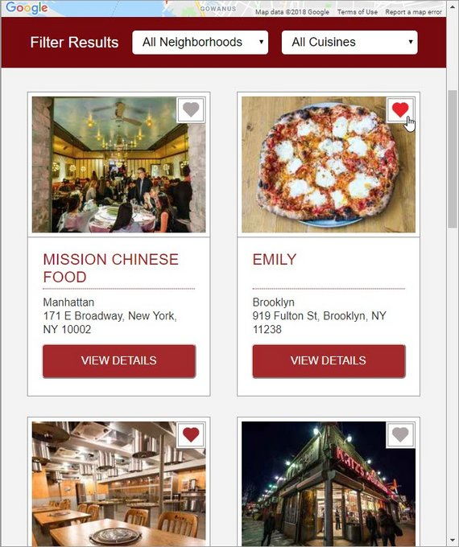
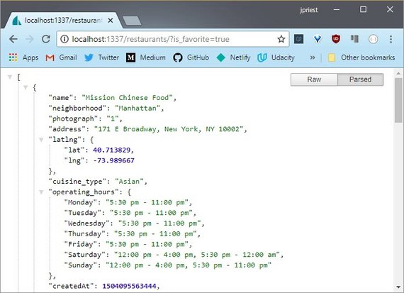
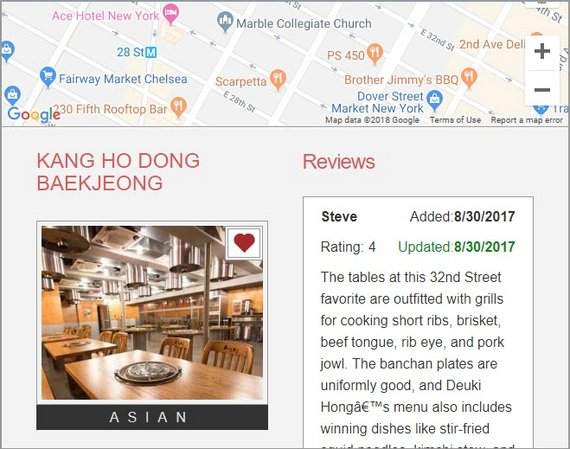
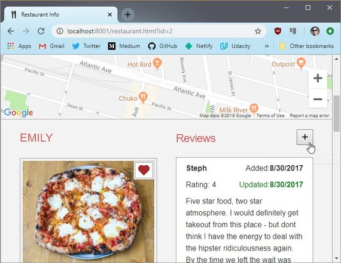
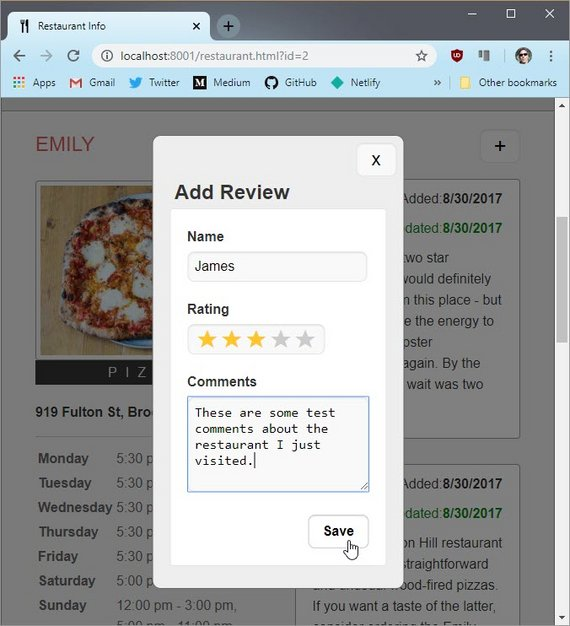
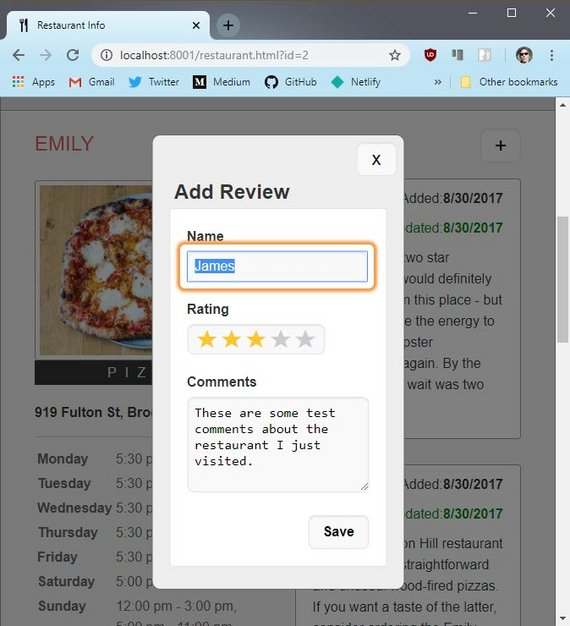
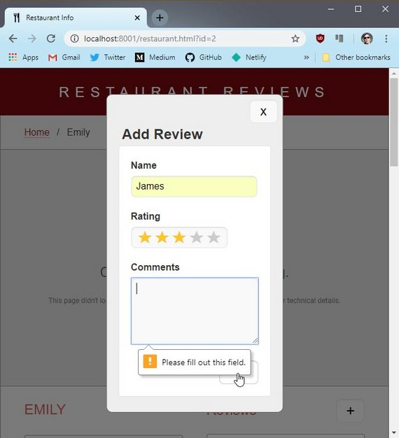
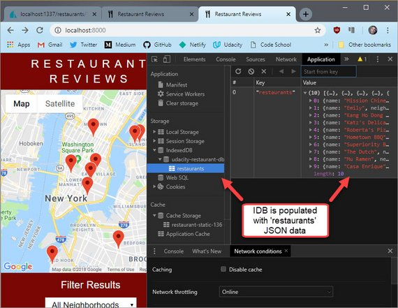
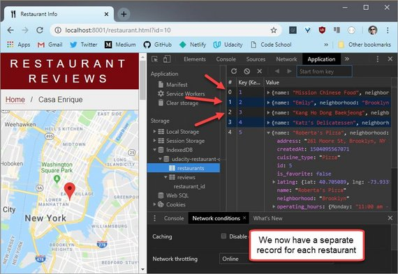

<!-- markdownlint-disable MD022 MD032 -->
# Code Notes

[<-- back to Restaurant Review Code Notes homepage](index.html)

---

### Requirements
Here are the requirements for Stage 3:
- Setup the REST server / review new end points
- Create Favorite toggle control
- Create Review form
- Bind new data to controls
- Cache new data to IDB
- Save review data when offline / Post when back online 
- Ensure Lighthouse performance benchmarks meet the following:
  - **Progressive Web App** - 90 or better
  - **Performance** - 90 or better
  - **Accessibility** - 90 or better

## 1. Stage 3 Prep
### 1.1 Fork & Clone Repo
The first thing to do was fork the [mws-restaurant-stage-3](https://github.com/udacity/mws-restaurant-stage-3) starter project.

This is a Local Development API Server and will not be the project we'll be working on. Instead, we spin this server up and continue extending the  work on our stage-1 project.

- Stage-1 consists of the front-end
- Stage-2 is a back end dev server that provides the API services our app will consume
- Stage-3 is another version of the back end server that provides additional API services for our app to consume

### 1.2 Install Dependencies
Read README.md. It describes the following steps to install all npm dependencies and spin up the server.

#### Install Global Dependencies
This should have been done from stage 2 but if it wasn't then run the command below.

```bash
npm install sails -g
```

#### Install Project Dependencies
Next install all project dependencies. This will install all packages that are detailed in the `packages.json` project file.

```bash
npm install
```

### 1.3 Start Server
You can then start the server with the following command.

```bash
node server
```

## 2. Ajax, Fetch & Endpoints
### 2.0 API Endpoints
View the MWS-Restaurant-Stage-3 [README.md]((https://github.com/james-priest/mws-restaurant-stage-3#endpoints)) in order to see each of the API Endpoints

#### GET Endpoints
- Get all restaurants
  - `http://localhost:1337/restaurants/`
- Get favorite restaurants
  - `http://localhost:1337/restaurants/?is_favorite=true`
- Get a restaurant by id
  - `http://localhost:1337/restaurants/<restaurant_id>`
- Get all reviews for a restaurant
  - `http://localhost:1337/reviews/?restaurant_id=<restaurant_id>`
- Get all restaurant reviews
  - `http://localhost:1337/reviews/`
- Get a restaurant review by id
  - `http://localhost:1337/reviews/<review_id>`

#### POST Endpoints
- Create a new restaurant review
  - `http://localhost:1337/reviews/`
  - Parameters
  ```bash
  {
      "restaurant_id": <restaurant_id>,
      "name": <reviewer_name>,
      "rating": <rating>,
      "comments": <comment_text>
  }
  ```

#### PUT Endpoints
- Favorite a restaurant
  - `http://localhost:1337/restaurants/<restaurant_id>/?is_favorite=true`
- Unfavorite a restaurant
  - `http://localhost:1337/restaurants/<restaurant_id>/?is_favorite=false`
- Update a restaurant review
  - `http://localhost:1337/reviews/<review_id>`
  - Parameters
  ```bash
  {
      "name": <reviewer_name>,
      "rating": <rating>,
      "comments": <comment_text>
  }
  ```

#### DELETE Endpoints
- Delete a restaurant review
  - `http://localhost:1337/reviews/<review_id>`

### 2.1 API Usage
The API can be tested in a few different ways. Here's what the README shows in terms of usage.

#### Usage
##### Get Restaurants

```bash
curl "http://localhost:1337/restaurants/"
```

##### Get Restaurants by id

```bash
curl "http://localhost:1337/restaurants/{3}"
```

### 2.2 Test API
There are a few different ways to test whether the API is working properly.

You can use
- Browser URL
- Fetch in Console
- Ajax Test App

### 2.3. Test API: Browser
A quick and dirty way to test is to copy the url into the url bar of your browser.

[](assets/images/2-1.jpg)
**Figure 1:** Browser URL

### 2.4. Test API: DevTools
You can also write a `fetch` request right in the console of your browser.

[](assets/images/2-2.jpg)
**Figure 2:** DevTools Fetch Call

You might have to use `<SHIFT>` + `<ENTER>` in order to skip lines without submitting the code.

What is initially returned is a Promise in *pending* state. Once the promise resolves the results should output to the console immediately afterwards.

You'll need to click the arrow to expand the array.

> **NOTE:** For security reasons you can only `fetch` from the same domain. Meaning you can't fetch data from `http://unsplash.com` if you are on `http://google.com`.
>
> Also note that if the Promise does not resolve with output to the console, you may need to refresh the page and try again.

[](assets/images/2-3.jpg)
**Figure 3:** DevTools Fetch Results

Here is the fetch code.

```js
fetch('http://localhost:1337/restaurants')
  .then(r => r.json())
  .then(data => console.log(data))
  .catch(e => console.log("Booo"))
```

### 2.5. Test API: Ajax App
You can use an app like Postman to really test all permutations of an Ajax call.

This is a good option if need to really test and understand what is returned in a complex Web API.

Here is the output of a restaurant call

[](assets/images/2-4.jpg)
**Figure 4:** Postman App

The advantage of an app like this is

1. You don't need to write complex code in the console to make it work. Just submit your fetch string as the request
2. The response is color coded and easier to read than browser output.

## 3. Favorite Control
### 3.1 Create Rollover Image
The first step was to grab a png of a heart to use as a favorite icon on the toggle button.

I copied the heart image two more time and varied the color. The states are as follows:

- On
- Off
- Hover

[](assets/images/3-1.jpg)<br>
**Figure 1:** Rollover PNG

### 3.2 Create Toggle Control
This image is then used as a background to a div created dynamically through JavaScript.

We first create the `<div>` element and then add the proper ARIA attributes. such as `aria-label`, `role='button'`, & `aria-pressed` attributes.

We also create the event handler.

#### main.js

```js
const createRestaurantHTML = (restaurant) => {
  const li = document.createElement('li');

  const fav = document.createElement('button');
  fav.className = 'fav-control';
  fav.setAttribute('aria-label', 'favorite');
  if (restaurant.is_favorite === 'true') {
    fav.classList.add('active');
    fav.setAttribute('aria-pressed', 'true');
    fav.innerHTML = `Remove ${restaurant.name} as a favorite`;
    fav.title = `Remove ${restaurant.name} as a favorite`;
  } else {
    fav.setAttribute('aria-pressed', 'false');
    fav.innerHTML = `Add ${restaurant.name} as a favorite`;
    fav.title = `Add ${restaurant.name} as a favorite`;
  }
  fav.addEventListener('click', (evt) => {
    evt.preventDefault();
    if (fav.classList.contains('active')) {
      fav.setAttribute('aria-pressed', 'false');
      fav.innerHTML = `Add ${restaurant.name} as a favorite`;
      fav.title = `Add ${restaurant.name} as a favorite`;
      DBHelper.unMarkFavorite(restaurant.id);
    } else {
      fav.setAttribute('aria-pressed', 'true');
      fav.innerHTML = `Remove ${restaurant.name} as a favorite`;
      fav.title = `Remove ${restaurant.name} as a favorite`;
      DBHelper.markFavorite(restaurant.id);
    }
    fav.classList.toggle('active');
  });
  li.append(fav);

  // more code
}
```

Next I had to include the favorite control on the details page as well.

This was done with both HTML and JavaScript

#### restaurant.html

```html
<div id="restaurant-img-container">
  <button id="restaurant-fav" aria-label="favorite"></button>
  
</div>
```

#### restaurant_info.js

```js
const fillRestaurantHTML = (restaurant = self.restaurant) => {
  const name = document.getElementById('restaurant-name');
  name.innerHTML = restaurant.name;

  const address = document.getElementById('restaurant-address');
  address.innerHTML = restaurant.address;

  const favorite = document.getElementById('restaurant-fav');
  if (restaurant.is_favorite === 'true') {
    favorite.classList.add('active');
    favorite.setAttribute('aria-pressed', 'true');
    favorite.innerHTML = `Remove ${restaurant.name} as a favorite`;
    favorite.title = `Remove ${restaurant.name} as a favorite`;
  } else {
    favorite.setAttribute('aria-pressed', 'false');
    favorite.innerHTML = `Add ${restaurant.name} as a favorite`;
    favorite.title = `Add ${restaurant.name} as a favorite`;
  }
  favorite.addEventListener('click', (evt) => {
    evt.preventDefault();
    if (favorite.classList.contains('active')) {
      favorite.setAttribute('aria-pressed', 'false');
      favorite.innerHTML = `Add ${restaurant.name} as a favorite`;
      favorite.title = `Add ${restaurant.name} as a favorite`;
      DBHelper.unMarkFavorite(restaurant.id);
    } else {
      favorite.setAttribute('aria-pressed', 'true');
      favorite.innerHTML = `Remove ${restaurant.name} as a favorite`;
      favorite.title = `Remove ${restaurant.name} as a favorite`;
      DBHelper.markFavorite(restaurant.id);
    }
    favorite.classList.toggle('active');
  });

  // more code
}
```

### 3.3 Create CSS
The css accounts for the control placement, size, & rollover effects.

This is the CSS for both the index page and the detail page.

#### styles.css

```css
#restaurants-list .fav-control {
  background-color: white;
  width: 44px;
  height: 40px;
  position: absolute;
  align-self: flex-end;
  margin-top: 6px;
  margin-left: -6px;
  padding: 5px;
  border: 1px solid #999;
  border: 4px double #999;
  background-image: url('../img/fixed/favorite5.png');
  background-repeat: no-repeat;
  background-position: 6px -26px;
  background-size: 24px;
  cursor: pointer;
  text-indent: -10000px;
}
#restaurants-list .fav-control.active  {
  background-position: 6px 5px;
}
#restaurants-list .fav-control:hover {
  background-position: 6px -59px;
}

#restaurant-img-container {
  display: flex;
  flex-direction: column;
}
#restaurant-fav {
  background-color: white;
  width: 44px;
  height: 40px;
  position: absolute;
  align-self: flex-end;
  margin-top: 6px;
  margin-left: -6px;
  padding: 5px;
  border: 1px solid #999;
  border: 4px double #999;
  background-image: url('../img/fixed/favorite5.png');
  background-repeat: no-repeat;
  background-position: 6px -27px;
  background-size: 24px;
  cursor: pointer;
  text-indent: -10000px;
}
#restaurant-fav.active {
  background-position: 6px 5px;
}
#restaurant-fav:hover {
  background-position: 6px -59px;
}
```

### 3.4 Create DB code
Next I created the Ajax code in the `dbhelper.js` file.

#### dbhelper.js

```js
// http://localhost:1337/restaurants/<restaurant_id>/?is_favorite=true
static markFavorite(id) {
  fetch(`${DBHelper.DATABASE_URL}/restaurants/${id}/?is_favorite=true`, {
    method: 'PUT'
  });
}

// http://localhost:1337/restaurants/<restaurant_id>/?is_favorite=false
static unMarkFavorite(id) {
  fetch(`${DBHelper.DATABASE_URL}/restaurants/${id}/?is_favorite=false`, {
    method: 'PUT'
  });
}
```

### 3.5 Test Favorite Toggle
Once this was done I tested it on both the index and details pages.

[](assets/images/3-2.jpg)
**Figure 2:** Favorite Control

Testing consisted of clicking the toggle button to make sure the control's class is updated appropriately and then viewing the database to make sure the record is updated properly.

[](assets/images/3-3.jpg)
**Figure 3:** Favorite API

## 4. Restaurant Reviews
### 4.1 Display Reviews
I had to change three files in order to get the Reviews to display properly.

- dbhelper.js
- restaurant_info.js
- styles.css

#### dbhelper.js
Added a new method to grab all reviews by restaurant id.

```js
  static fetchRestaurantReviewsById(id, callback) {
    fetch(DBHelper.DATABASE_URL + `/reviews/?restaurant_id=${id}`)
      .then(response => response.json())
      .then(data => callback(null, data))
      .catch(err => callback(err, null));
  }
```

#### restaurant_info.js
Added this call to the `fillRestaurantHTML` method

```js
DBHelper.fetchRestaurantReviewsById(restaurant.id, fillReviewsHTML);
```

Then modified the `fillReviewsHTML` callback method to work with the returned data from `dbhelper.js` file.

```js
const fillReviewsHTML = (error, reviews) => {
  self.restaurant.reviews = reviews;

  if (error) {
    console.log('Error retrieving reviews', error);
  }

  // more code...
}
```

Add additional code the the `createReviewHTML` method.

```js
const createReviewHTML = (review) => {
  const li = document.createElement('li');
  const name = document.createElement('p');
  name.innerHTML = review.name;
  li.appendChild(name);

  const createdAt = document.createElement('p');
  createdAt.classList.add('createdAt');
  const createdDate = new Date(review.createdAt).toLocaleDateString();
  createdAt.innerHTML = `Added:<strong>${createdDate}</strong>`;
  li.appendChild(createdAt);

  const updatedAt = document.createElement('p');
  const updatedDate = new Date(review.updatedAt).toLocaleDateString();
  updatedAt.innerHTML = `Updated:<strong>${updatedDate}</strong>`;
  updatedAt.classList.add('updatedAt');
  li.appendChild(updatedAt);

  const rating = document.createElement('p');
  rating.classList.add('rating');
  rating.innerHTML = `Rating: ${review.rating}`;
  rating.dataset.rating = review.rating;
  li.appendChild(rating);

  const comments = document.createElement('p');
  comments.classList.add('comments');
  comments.innerHTML = review.comments;
  li.appendChild(comments);

  return li;
};
```

#### restaurant.html
Added a `<div id='reviews-header'></div>` to the html...

```html
<section id="reviews-container" aria-label="Reviews">
  <div id="reviews-header"></div>
  <ul id="reviews-list"></ul>
</section>
```

#### styles.css
Added these review display classes.

```css
#reviews-header {
  display: flex;
  align-items: flex-start;
  justify-content: space-between;
}
#reviews-list li p.createdAt {
  float: right;
}
#reviews-list li p.updatedAt {
  float: right;
  color: #008800;
  clear: both;
}
#reviews-list li p.rating {
  float: left;
}
#reviews-list li p.comments {
  clear: both;
}
```

Once the code is in place the reviews should display like this.

[](assets/images/3-4.jpg)
**Figure 4:** Reviews

### 4.2 Create a Modal Popup
The first step in creating an "Add Review" form is to create the modal popup that will contain the form.

I start this by creating a `<div id="modal"></div>` right under the body tag in the `restaurant.html` file.

#### restaurant.html

```html
<body class="inside">
  <div id="modal">
    <button class="close-btn" onclick="toggleModal(event)" aria-label="close"
            title="Close">x</button>
    <div id="review-form"></div>
  </div>
```

I then add a `<div id="reviews-header"></div>` to the `reviews-container` section element. This will contain the "Add Review" button justified right of the Reviews header .

```html
<section id="reviews-container" aria-label="Reviews">
  <div id="reviews-header"></div>
  <ul id="reviews-list"></ul>
</section>
```

Next, I update the `restaurant_info.js` file. The first thing to do is add the modal control.

#### restaurant_info.js

```js
const toggleModal = (evt) => {
  evt.preventDefault();
  const modal = document.getElementById('modal');
  modal.classList.toggle('show');
};
```

The next thing I do is update the `fillReviewsHTML` method.

```js
const fillReviewsHTML = (error, reviews) => {
  self.restaurant.reviews = reviews;

  if (error) {
    console.log('Error retrieving reviews', error);
  }
  const header = document.getElementById('reviews-header');

  const title = document.createElement('h2');
  title.innerHTML = 'Reviews';
  header.appendChild(title);
  
  const addReview = document.createElement('button');
  addReview.classList.add('review-add-btn');
  addReview.innerHTML = '+';
  addReview.setAttribute('aria-label', 'add review');
  addReview.title = 'Add Review';
  addReview.addEventListener('click', toggleModal);
  header.appendChild(addReview);
  
  const container = document.getElementById('reviews-container');
  if (!reviews) {
    const noReviews = document.createElement('p');
    noReviews.innerHTML = 'No reviews yet!';
    container.appendChild(noReviews);
    return;
  }
  const ul = document.getElementById('reviews-list');
  reviews.forEach(review => {
    ul.appendChild(createReviewHTML(review));
  });
  container.appendChild(ul);
};
```

Lastly, I updated the CSS with the appropriate styles to ensure the modal dialog always aligns and centers itself properly.

This was done by following a tip on CSS Tricks ([CSS Tricks Styling a Modal](https://css-tricks.com/considerations-styling-modal/ )).

I also added styling for the "Add Review" button and the "Close" button on the modal form.

```css
#reviews-header {
  display: flex;
  align-items: flex-start;
  justify-content: space-between;
}
#reviews-container .review-add-btn {
  padding: 0 8px;
  font-size: 1.6em;
  cursor: pointer;
}
#modal {
  /* begin css tricks */
  position: fixed;
  top: 50%;
  left: 50%;
  transform: translate(-50%, -50%);
  /* end css tricks */
  z-index: -10;
  display: flex;
  flex-direction: column;
  width: 80vw;
  height: 80vh;
  border: 1px solid #666;
  border-radius: 10px;
  opacity: 0;
  transition: all .3s;
  overflow: hidden;
  background-color: #eee;
}
#modal.show {
  opacity: 1;
  z-index: 10;
}
#modal .close-btn {
  align-self: flex-end;
  font-size: 1.6em;
  margin: 8px;
  padding: 0 8px;
  cursor: pointer;
}
#review-form {
  width: 100%;
  padding: 20px 26px;
  color: #333;
  overflow-y: auto;
}
```

The initial "Add Review" button is added to the right of the Review header.

[](assets/images/3-5.jpg)
**Figure 5:** Add Review Button

When we click the button, a perfectly centered modal popup animates open using the css `transition` property.

[](assets/images/3-6.jpg)
**Figure 6:** Add Review Model Popup

We also use this same transition to animate the modal closed when the "Close" button is clicked.

## 5. Add Review Form
### 5.1 List of Changes
I performed quite a few modifications to the app so far.  I did these in stages but will list all out here as a group. This includes the following:

#### Improved the modal pop-up
- Popup now centers itself properly
- Employs a modal-overlay that grays out all non-modal page elements
- Improved CSS treatment for cleaner look and better accessibility. Now has
  - rounded corners
  - 16px font-size
  - large 48px wide tap targets

#### Add Review Form
- Traps keyboard navigation so that ESC exits and TAB or SHIFT+TAB navigates
- Includes a star rating control based on standard HTML radio input
- Includes proper ARIA and accessibility labels and roles
- Includes form validation

### 5.2 HTML Updates

#### restaurant.html

```html
<!-- Beginning modal -->
<div id="modal" role="dialog" aria-modal="true"
  aria-labelledby="add-review-header">
  <button class="close-btn" aria-label="close" title="Close">x</button>
  <div id="review-form-container">
    <h2 id="add-review-header">Add Review</h2>
    <form id="review-form">
      <div class="fieldset">
        <label for="reviewName">Name</label>
        <input type="text" name="reviewName" id="reviewName" required>
      </div>
      <div class="fieldset">
        <label>Rating</label>
        <div class="rate">
          <input type="radio" id="star5" name="rate" value="5"
            onkeydown="navRadioGroup(event)"
            onfocus="setFocus(event)" required />
          <label for="star5" title="5 stars">5 stars</label>
          <input type="radio" id="star4" name="rate" value="4"
            onkeydown="navRadioGroup(event)" />
          <label for="star4" title="4 stars">4 stars</label>
          <input type="radio" id="star3" name="rate" value="3"
            onkeydown="navRadioGroup(event)" />
          <label for="star3" title="3 stars">3 stars</label>
          <input type="radio" id="star2" name="rate" value="2"
            onkeydown="navRadioGroup(event)" />
          <label for="star2" title="2 stars">2 stars</label>
          <input type="radio" id="star1" name="rate" value="1"
            onkeydown="navRadioGroup(event)" onfocus="setFocus(event)" />
          <label for="star1" title="1 star">1 star</label>
        </div>
      </div>
      <div class="fieldset">
        <label for="reviewComments">Comments</label>
        <textarea name="reviewComments" id="reviewComments"
          cols="20" rows="5" required></textarea>
      </div>
      <div class="fieldset right">
        <button id="submit-review-btn">Save</button>
      </div>
    </form>
  </div>
</div>
<div class="modal-overlay"></div>
<!-- End modal -->
```

### 5.3 CSS Updates

#### styles.css

```css
/* ====================== Review Form ====================== */
#modal {
  /* fix exactly center: https://css-tricks.com/considerations-styling-modal/ */
  /* begin css tricks */
  position: fixed;
  top: 50%;
  left: 50%;
  transform: translate(-50%, -50%);
  /* end css tricks */
  z-index: 3;
  display: flex;
  flex-direction: column;
  border: 1px solid #666;
  border-radius: 10px;
  opacity: 0;
  transition: all .3s;
  overflow: hidden;
  background-color: #eee;
  display: none;
}
#modal.show {
  opacity: 1;
  display: flex
}
.modal-overlay {
  width: 100%;
  height: 100%;
  z-index: 2; /* places the modalOverlay between main page and modal dialog */
  background-color: #000;
  opacity: 0;
  transition: all .3s;
  position: fixed;
  top: 0;
  left: 0;
  display: none;
  margin: 0;
  padding: 0;
}
.modal-overlay.show {
  display: block;
  opacity: 0.5;  
}
#modal .close-btn {
  align-self: flex-end;
  font-size: 1.4em;
  margin: 8px 8px 0;
  padding: 0 8px;
  cursor: pointer;
}
form {
  max-width: 900px;
  padding: 0 20px 20px 20px;
}
input, select, .rate, textarea, button {
  background: #f9f9f9;
  border: 1px solid #e5e5e5;
  border-radius: 8px;
  box-shadow: inset 0 1px 1px #e1e1e1;
  font-size: 16px;
  padding: 8px;
}
input[type="radio"] {
  box-shadow: none;
}
button {
  min-width: 48px;
  min-height: 48px;
}
button:hover {
  border: 1px solid #ccc;
  background-color: #fff;
}
button#review-add-btn, 
button.close-btn, 
button#submit-review-btn {
  min-height: 40px;
}
button#submit-review-btn {
  font-weight: bold;
  cursor: pointer;
  padding: 0 16px;
}

.fieldset {
  margin-top: 20px;
}
.right {
  align-self: flex-end;
}
#review-form-container {
  width: 100%;
  padding: 0 20px 26px;
  color: #333;
  overflow-y: auto;
}
#review-form-container h2 {
  margin: 0 0 0 6px;
}
#review-form {
  display: flex;
  flex-direction: column;
  background: #fff;
  border: 1px solid #e5e5e5;
  border-radius: 4px;
}
#review-form label, #review-form input {
  display: block;
}
#review-form label {
  font-weight: bold;
  margin-bottom: 5px;
}

#review-form .rate label, #review-form .rate input,
#review-form .rate1 label, #review-form .rate1 input {
  display: inline-block;
}
/* Modified from: https://codepen.io/tammykimkim/pen/yegZRw */
.rate {
  height: 36px;
  display: inline-flex;
  flex-direction: row-reverse;
  align-items: flex-start;
  justify-content: flex-end;
}
#review-form .rate > label {
  margin-bottom: 0;
  margin-top: -5px;
  height: 30px;
}
.rate:not(:checked) > input {
  top: -9999px;
  margin-left: -24px;
  width: 20px;
  padding-right: 14px;
  z-index: -10;
}
.rate:not(:checked) > label {
  float:right;
  width:1em;
  overflow:hidden;
  white-space:nowrap;
  cursor:pointer;
  font-size:30px;
  color:#ccc;
}
.rate:not(:checked) > label::before {
  content: '★ ';
  position: relative;
  top: -10px;
  left: 2px;
}
.rate > input:checked ~ label {
  color: #ffc700;
}
.rate > input:checked:focus + label, .rate > input:focus + label {
  outline: -webkit-focus-ring-color auto 5px;
}
.rate:not(:checked) > label:hover,
.rate:not(:checked) > label:hover ~ label {
  color: #deb217;
}
.rate > input:checked + label:hover,
.rate > input:checked + label:hover ~ label,
.rate > input:checked ~ label:hover,
.rate > input:checked ~ label:hover ~ label,
.rate > label:hover ~ input:checked ~ label {
  color: #c59b08;
}
#submit-review {
  align-self: flex-end;
}
```

### 5.4 JS Updates

#### restaurant_info.js

```js
var focusedElementBeforeModal;
const modal = document.getElementById('modal');
const modalOverlay = document.querySelector('.modal-overlay');

// Adapted from modal dialog sample code in Udacity Web Accessibility course 891
const openModal = () => {
  // Save current focus
  focusedElementBeforeModal = document.activeElement;

  // Listen for and trap the keyboard
  modal.addEventListener('keydown', trapTabKey);

  // Listen for indicators to close the modal
  modalOverlay.addEventListener('click', closeModal);
  // Close btn
  const closeBtn = document.querySelector('.close-btn');
  closeBtn.addEventListener('click', closeModal);

  // submit form
  const form = document.getElementById('review-form');
  form.addEventListener('submit', saveAddReview, false);

  // Find all focusable children
  var focusableElementsString = 'a[href], area[href], input:not([disabled]),' +
    'select:not([disabled]), textarea:not([disabled]), button:not([disabled]),' + 
    'iframe, object, embed, [tabindex="0"], [contenteditable]';
  var focusableElements = modal.querySelectorAll(focusableElementsString);
  // Convert NodeList to Array
  focusableElements = Array.prototype.slice.call(focusableElements);

  var firstTabStop = focusableElements[0];
  var lastTabStop = focusableElements[focusableElements.length - 1];

  // Show the modal and overlay
  modal.classList.add('show');
  modalOverlay.classList.add('show');

  // Focus first child
  // firstTabStop.focus();
  const reviewName = document.getElementById('reviewName');
  reviewName.focus();

  function trapTabKey(e) {
    // Check for TAB key press
    if (e.keyCode === 9) {

      // SHIFT + TAB
      if (e.shiftKey) {
        if (document.activeElement === firstTabStop) {
          e.preventDefault();
          lastTabStop.focus();
        }

      // TAB
      } else {
        if (document.activeElement === lastTabStop) {
          e.preventDefault();
          firstTabStop.focus();
        }
      }
    }

    // ESCAPE
    if (e.keyCode === 27) {
      closeModal();
    }
  }
};

const saveAddReview = (e) => {
  e.preventDefault();

  const name = document.querySelector('#reviewName').value;
  const rating = document.querySelector('input[name=rate]:checked').value;
  const comments = document.querySelector('#reviewComments').value;
  
  // console.log(name);
  // console.log(rating);
  // console.log(comments);

  DBHelper.createRestaurantReview(self.restaurant.id, name, rating, comments,
    (error, review) => {
    console.log('got callback');
    if (error) {
      console.log('Error saving review');
    } else {
      // do some other stuff
      console.log(review);
      window.location.href = `/restaurant.html?id=${self.restaurant.id}`;
    }
  });
};

const closeModal = () => {
  // Hide the modal and overlay
  modal.classList.remove('show');
  modalOverlay.classList.remove('show');

  const form = document.getElementById('review-form');
  form.reset();
  // Set focus back to element that had it before the modal was opened
  focusedElementBeforeModal.focus();
};

const setFocus = (evt) => {
  const rateRadios = document.getElementsByName('rate');
  const rateRadiosArr = Array.from(rateRadios);
  const anyChecked = rateRadiosArr.some(radio => { 
    return radio.checked === true; 
  });
  if (!anyChecked) {
    const star1 = document.getElementById('star1');
    star1.focus();
  }
};

// this code is done for proper a11y & keyboard nav
const navRadioGroup = (evt) => {
  const star1 = document.getElementById('star1');  
  const star2 = document.getElementById('star2');  
  const star3 = document.getElementById('star3');  
  const star4 = document.getElementById('star4');  
  const star5 = document.getElementById('star5');  

  if (['ArrowRight', 'ArrowLeft', 'ArrowDown', 'ArrowUp'].includes(evt.key)) {
    evt.preventDefault();
    // console.log('attempting return');
    if (evt.key === 'ArrowRight' || evt.key === 'ArrowDown') {
      switch(evt.target.id) {
        case 'star1':
          star2.focus();
          star2.checked = true;
          break;
        case 'star2':
          star3.focus();
          star3.checked = true;
          break;
        case 'star3':
          star4.focus();
          star4.checked = true;
          break;
        case 'star4':
          star5.focus();
          star5.checked = true;
          break;
        case 'star5':
          star1.focus();
          star1.checked = true;
          break;
      }
    } else if (evt.key === 'ArrowLeft' || evt.key === 'ArrowUp') {
      switch(evt.target.id) {
        case 'star1':
          star5.focus();
          star5.checked = true;
          break;
        case 'star2':
          star1.focus();
          star1.checked = true;
          break;
        case 'star3':
          star2.focus();
          star2.checked = true;
          break;
        case 'star4':
          star3.focus();
          star3.checked = true;
          break;
        case 'star5':
          star4.focus();
          star4.checked = true;
          break;
      }
    }
  }
};
```

### 5.5 Database Updates

#### dbhelper.js

```js
// http://localhost:1337/reviews/
static createRestaurantReview(id, name, rating, comments, callback) {
  const data = {
    'restaurant_id': id,
    'name': name,
    'rating': rating,
    'comments': comments
  };
  fetch(DBHelper.DATABASE_URL + '/reviews/', {
    method: 'POST',
    body: JSON.stringify(data)
  })
    .then(response => response.json())
    .then(data => callback(null, data))
    .catch(err => callback(err, null));
}
```

### 5.6 Screenshots

#### Completed Form
This is the completed form.

[](assets/images/3-7.jpg)
**Figure 7:** Add Review Form

#### Screen Reader
This is the form with ChromeVox turned on.

[](assets/images/3-8.jpg)
**Figure 8:** Form with Screen Reader

#### Form Validation
This is the form with intrinsic HTML5 validation.

[](assets/images/3-9.jpg)
**Figure 9:** Form Validation

## 6. Redesign IDB Storage
### 6.1 Previous Schema
Previously all restaurant records were saved as a single large json file under a single key of 'restaurants'.

[](assets/images/2-13.jpg)
**Figure 10:** Old object store schema

This was fine for stage 2 of our project since each of our methods worked against the entire dataset.  Now in stage 3 we need more granular access and control of our data.

### 6.2 New schema
In order better represent the data within our local IndexedDB store we've now separated each restaurant into it's own record.

[](assets/images/3-11.jpg)
**Figure 11:** New object store schema

This has the benefit of allowing us to update each restaurant individually without having to rebuild the entire dataset.

This will come in handy when we need to update a restaurant's "favorite" status.

### 6.3 Updated IDB Code
In order to break out the restaurants so that each is given it's own IDB record, we needed to loop through the `restaurants` json.

This is done in the service worker code (`sw.js`).

We first start by looking at the code to intercept all fetch requests. If a call includes port 1337 then it's a request for restaurant data from the database.

```js
// intercept all requests
// return cached asset, idb data, or fetch from network
self.addEventListener('fetch', event => {
  const request = event.request;
  const requestUrl = new URL(request.url);
  
  // 1. filter Ajax Requests
  if (requestUrl.port === '1337') {
    event.respondWith(idbRestaurantResponse(request));
  }
  else {
    event.respondWith(cacheResponse(request));
  }
});
```

In this case we follow that to the `idbRestaurantResponse` function.

```js
let j = 0;
function idbRestaurantResponse(request, id) {
  // 1. getAll records from objectStore
  // 2. if more than 1 rec then return match
  // 3. if no match then fetch json, write to idb, & return response

  return idbKeyVal.getAll('restaurants')
    .then(restaurants => {
      if (restaurants.length) {
        return restaurants;
      }
      return fetch(request)
        .then(response => response.json())
        .then(json => {
          json.forEach(restaurant => {  // <- this line loops thru the json
            console.log('fetch idb write', ++j, restaurant.id, restaurant.name);
            idbKeyVal.set('restaurants', restaurant); // <- writes each record
          });
          return json;
        });
    })
    .then(response => new Response(JSON.stringify(response)))
    .catch(error => {
      return new Response(error, {
        status: 404,
        statusText: 'my bad request'
      });
    });
}
```

The only other new piece of code is the `getAll` method on our `idbKeyVal` object literal.  This returns the whole record set for an object store.

```js
// IndexedDB object with get, set, getAll, & getAllIdx methods
// https://github.com/jakearchibald/idb
const idbKeyVal = {
  get(store, key) {
    return dbPromise.then(db => {
      return db
        .transaction(store)
        .objectStore(store)
        .get(key);
    });
  },
  getAll(store) {
    return dbPromise.then(db => {
      return db
        .transaction(store)
        .objectStore(store)
        .getAll();
    });
  },
  set(store, val) {
    return dbPromise.then(db => {
      const tx = db.transaction(store, 'readwrite');
      tx.objectStore(store).put(val);
      return tx.complete;
    });
  }
};
```