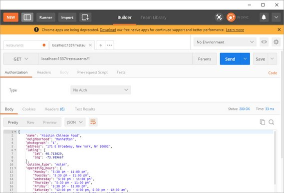

<!-- markdownlint-disable MD022 MD032 -->
# Code Notes

[<-- back to Restaurant Review Code Notes homepage](index.html)

---

### Requirements
The nanodegree only had three stages to complete in order to meet all requirements. 

I'm adding a fourth stage which will include necessary changes to properly host this app as part of my online portfolio.

In order to do this there are a few things that need to happen. I need to:

1. Set up a NoSQL DB to contain the restaurant data
2. Create a RESTful API to perform operations against the DB
3. Make any necessary changes to the client app so it uses the new API.

Items one and two really fall under the realm of back end services and back end programming but I figured this was a good full-stack exercise.

Requirements so far:
- Create a hosted DB instance (NoSQL)
- Import all existing data to new DB
- Setup a backend REST server
- Expose RESTful end points (approximating the old API as closely as possible)
- Update `dbhelper.js` to use new DB source
- Update fetch handlers to work with any changes in the DB model (if necessary)
- Modify Service Worker to properly handle requests to new data source
- Modify IndexedDB code to correctly handle any changes to data schema
- Add DELETE capability to the `reviews` data
- Add EDIT capability (if time permits) to the `reviews` data
- Ensure Lighthouse performance benchmarks still meet the following:
  - **Progressive Web App** - 90 or better
  - **Performance** - 90 or better
  - **Accessibility** - 90 or better

## 1. NoSQL with RESTful API
### 1.1 NoSQL Databases
The first thing I did was look into some NoSQL solutions. What I focused on was

- [MongoDB](https://www.mongodb.com/nosql-explained) - an open-source NoSQL document-oriented database solution
- [CouchDB](http://couchdb.apache.org/) - an open-source NoSQL document object store with strong sync and HTTP API
- [PouchDB](https://pouchdb.com/guides/) - a local JavaScript implementation of CouchDB that syncs to remote a CouchDB or CouchDB variant (e.g. Cloudant)

There were many, many others but this was a good start.

While PouchDB sounds great for my next offline project, it requires me to integrate and code against the PouchDB js library in my client app.

Maybe that'll be a stage 5 rollout but for now I'd like to refactor my client code as little as possible.

So what I found was great in concept but these are server-based solutions that still needed to be hosted somewhere. 

I did not want to take on the cost of spinning up a VM in order to host this so I decided to look into [Database-as-a-Service (DBaaS)](https://www.g2crowd.com/categories/database-as-a-service-dbaas) hosted solutions.

### 1.2 Cloud Services Defined
Let me first define two ends of a broad spectrum with regards to ways of providing a software solution.

1. On-premises using your own equipment, infrastructure, & software
2. Fully hosted Software-as-a-Service (SaaS) where you pay a monthly fee to utilize a pre-built software solution.

Prior to cloud computing, these were the two primary ways to provide software solutions to your clients.

Now we have a broad range of services that fall somewhere on the spectrum between these two extremes.


**Figure 1:** On-Premises, Iaas, Paas, Saas

Starting with the lowest level of service and abstraction...

- [IaaS (Infractructure-as-a-Service)](https://www.g2crowd.com/categories/infrastructure-as-a-service-iaas) - allows users to outsource computing infrastructure including servers, storage, networking & VMs.
  - Amazon EC2, Google Compute Engine, Digital Ocean, Azure VMs
- [PaaS (Platform-as-a-Service)](https://www.g2crowd.com/categories/cloud-platform-as-a-service-paas) - provides users with tools to develop, run, and manage web applications.
  - Heroku, Azure Web Apps, Google App Engine, AWS Lambda, Azure Functions, Google Cloud Functions, Salesforce Platform
- [mBaaS (Mobile-Backbone-as-a-Service)](https://www.g2crowd.com/categories/mobile-backend-as-a-service-mbaas) - provides cloud computing architecture for mobile applications, giving developers the ability to connect their app to cloud storage and APIs.
  - Heroku, AWS Mobile Hub, Google Firebase, Parse, built.io Backend, Parse, MongoDB Stitch, Rackspace Managed Cloud
- [DBaaS (Database-as-a-Service)](https://www.g2crowd.com/categories/database-as-a-service-dbaas) - provides prebuilt database backend infrastructure for mobile and web applications. Can include relational or NoSQL (key/value, document, graph, etc.).
  - MongoDB Atlas, Amazon RDS, Amazon DynamoDB, AWS SimpleDB, Azure Tables, Azure DocumentDB, Azure Cosmos, Azure SQL DB, Google Datastore, Google Cloud SQL
- [SaaS (Software-as-a-Service)](https://azure.microsoft.com/en-us/overview/what-is-saas/) - Provides a straight browser-based software solution. These are paid for app services.
  - Google Apps, Salesforce, DropBox, Constant Contact, etc.

### 1.3 Hosted DB Solutions

There are many offered solutions including:

- AWS (Amazon) - [Amazon SimpleDB](https://aws.amazon.com/simpledb/) and [Amazon DynamoDB](https://aws.amazon.com/dynamodb/)
- Azure (Microsoft) - [Azure Tables](https://azure.microsoft.com/en-us/services/storage/tables/) and [Azure CosmosDB](https://azure.microsoft.com/en-us/services/cosmos-db/)
- Google - [Cloud Firestore](https://cloud.google.com/firestore/) and [Firebase Realtime Database](https://firebase.google.com/products/realtime-database/)
- Cloudant (IBM's hosted CouchDB) - [Cloudant Lite](https://www.ibm.com/cloud/cloudant/pricing) and [PouchDB Client Library](https://pouchdb.com/)

See [NoSQL Hosted examples on Wikipedia](https://en.wikipedia.org/wiki/NoSQL#Hosted).

These all offer pay as you go service models and require additional setup for REST API access. These are definitely larger scale options than I wanted to invest in.

I looked into FaunaDB which was recommended by Netlify.

- [FaunaDB](https://fauna.com/) - NoSQL DB solution requiring a client library and relies on AWS-style Lamba functions for RESTful API.

Again, I wanted a simple, no-cost solution that offers both NoSQL DB storage and REST API access out-of-the-box.

Here's what I finally decided on:

- [restdb.io](https://restdb.io/) - Simple NoSQL database with data management app, schema builder, and REST API instantly available. Free DEV account with 1 MB size limit.

Perfect! Looks like restdb.io fits the bill.

<!--
## 2. Using restdb.io

### 2.1 Creating the DB
### 2.1. Test API: Postman
You can use an app like Postman to really test all permutations of an Ajax call.

This is a good option if need to really test and understand what is returned in a complex Web API.

Here is the output of a restaurant call

[](assets/images/2-4.jpg)
**Figure 4:** Postman App

The advantage of an app like this is

1. You don't need to write complex code in the console to make it work.
2. Requests can be grouped into collections
3. The response is color coded and easier to read than browser output.

### 2.1 API Endpoints
View the MWS-Restaurant-Stage-3 [README.md]((https://github.com/james-priest/mws-restaurant-stage-3#endpoints)) in order to see each of the API Endpoints

#### GET Endpoints
- Get all restaurants
  - `http://localhost:1337/restaurants/`
- Get favorite restaurants
  - `http://localhost:1337/restaurants/?is_favorite=true`
- Get a restaurant by id
  - `http://localhost:1337/restaurants/<restaurant_id>`
- Get all reviews for a restaurant
  - `http://localhost:1337/reviews/?restaurant_id=<restaurant_id>`
- Get all restaurant reviews
  - `http://localhost:1337/reviews/`
- Get a restaurant review by id
  - `http://localhost:1337/reviews/<review_id>`

#### POST Endpoints
- Create a new restaurant review
  - `http://localhost:1337/reviews/`
  - Parameters
  ```bash
  {
      "restaurant_id": <restaurant_id>,
      "name": <reviewer_name>,
      "rating": <rating>,
      "comments": <comment_text>
  }
  ```

#### PUT Endpoints
- Favorite a restaurant
  - `http://localhost:1337/restaurants/<restaurant_id>/?is_favorite=true`
- Unfavorite a restaurant
  - `http://localhost:1337/restaurants/<restaurant_id>/?is_favorite=false`
- Update a restaurant review
  - `http://localhost:1337/reviews/<review_id>`
  - Parameters
  ```bash
  {
      "name": <reviewer_name>,
      "rating": <rating>,
      "comments": <comment_text>
  }
  ```

#### DELETE Endpoints
- Delete a restaurant review
  - `http://localhost:1337/reviews/<review_id>`

 -->