<!-- markdownlint-disable MD022 MD032 -->
# Code Notes

[<-- back to Restaurant Review Code Notes homepage](index.html)

---

### Requirements
The nanodegree only had three stages to complete in order to meet all requirements. 

I'm adding a fourth stage which will include necessary changes to properly host this app as part of my online portfolio.

In order to do this there are a few things that need to happen. I need to:

1. Set up a NoSQL DB to contain the restaurant data
2. Create a RESTful API to perform operations against the DB
3. Make any necessary changes to the client app so it uses the new API.

Items one and two really fall under the realm of back end services and back end programming but I figured this was a good full-stack exercise.

Requirements so far:
- Create a hosted DB instance (NoSQL)
- Import all existing data to new DB
- Setup a backend REST server
- Expose RESTful end points (approximating the old API as closely as possible)
- Update `dbhelper.js` to use new DB source
- Update fetch handlers to work with any changes in the DB model (if necessary)
- Modify Service Worker to properly handle requests to new data source
- Modify IndexedDB code to correctly handle any changes to data schema
- Add DELETE capability to the `reviews` data
- Add EDIT capability (if time permits) to the `reviews` data
- Ensure Lighthouse performance benchmarks still meet the following:
  - **Progressive Web App** - 90 or better
  - **Performance** - 90 or better
  - **Accessibility** - 90 or better

## 1. Back End Data Services
What I need in a nutshell is a NoSQL DB that exposes a set of RESTful APIs for CRUD (Create, Read, Update, & Delete) operations.

### 1.1 NoSQL Databases
The first thing I did was look into some NoSQL solutions. What I focused on was

- [MongoDB](https://www.mongodb.com/nosql-explained) - an open-source NoSQL document-oriented database solution
- [CouchDB](http://couchdb.apache.org/) - an open-source NoSQL document object store with strong sync and HTTP API
- [PouchDB](https://pouchdb.com/guides/) - a local JavaScript implementation of CouchDB that syncs to remote a CouchDB or CouchDB variant (e.g. Cloudant)

There were many, many others but this was a good start.

While PouchDB sounds great for my next offline project, it requires me to integrate and code against the PouchDB js library in my client app.

Maybe that'll be a stage 5 rollout but for now I'd like to refactor my client code as little as possible.

So what I found was great in concept but these are server-based solutions that still needed to be hosted somewhere. 

I did not want to take on the cost of spinning up a VM in order to host this so I decided to look into [Database-as-a-Service (DBaaS)](https://www.g2crowd.com/categories/database-as-a-service-dbaas) hosted solutions.

### 1.2 Cloud Services Defined
Let me first define two ends of a broad spectrum with regards to ways of providing a software solution.

1. On-premises using your own equipment, infrastructure, & software
2. Fully hosted Software-as-a-Service (SaaS) where you pay a monthly fee to utilize a pre-built software solution.

Prior to cloud computing, these were the two primary ways to provide software solutions to your clients.

Now we have a broad range of services that fall somewhere on the spectrum between these two extremes.

[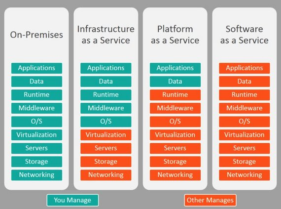](assets/images/4-1.jpg)
**Figure 1:** On-Premises, Iaas, Paas, Saas

Starting with the lowest level of service and abstraction...

- [IaaS (Infractructure-as-a-Service)](https://www.g2crowd.com/categories/infrastructure-as-a-service-iaas) - allows users to outsource computing infrastructure including servers, storage, networking & VMs.
  - Amazon EC2, Google Compute Engine, Digital Ocean, Azure VMs
- [PaaS (Platform-as-a-Service)](https://www.g2crowd.com/categories/cloud-platform-as-a-service-paas) - provides users with tools to develop, run, and manage web applications.
  - Heroku, Azure Web Apps, Google App Engine, AWS Lambda, Azure Functions, Google Cloud Functions, Salesforce Platform
- [mBaaS (Mobile-Backbone-as-a-Service)](https://www.g2crowd.com/categories/mobile-backend-as-a-service-mbaas) - provides cloud computing architecture for mobile applications, giving developers the ability to connect their app to cloud storage and APIs.
  - Heroku, AWS Mobile Hub, Google Firebase, Parse, built.io Backend, Parse, MongoDB Stitch, Rackspace Managed Cloud
- [DBaaS (Database-as-a-Service)](https://www.g2crowd.com/categories/database-as-a-service-dbaas) - provides prebuilt database backend infrastructure for mobile and web applications. Can include relational or NoSQL (key/value, document, graph, etc.).
  - MongoDB Atlas, Amazon RDS, Amazon DynamoDB, AWS SimpleDB, Azure Tables, Azure DocumentDB, Azure Cosmos, Azure SQL DB, Google Datastore, Google Cloud SQL
- [SaaS (Software-as-a-Service)](https://azure.microsoft.com/en-us/overview/what-is-saas/) - Provides a straight browser-based software solution. These are paid and free app services.
  - Google Apps, Salesforce, DropBox, Constant Contact, etc.

### 1.3 Hosted DB Solutions
Seeing as I only need a DB solution that exposes a REST API, this narrowed my search.

Still, there are many offered solutions though, including:

- AWS (Amazon) - [Amazon SimpleDB](https://aws.amazon.com/simpledb/) and [Amazon DynamoDB](https://aws.amazon.com/dynamodb/)
- Azure (Microsoft) - [Azure Tables](https://azure.microsoft.com/en-us/services/storage/tables/) and [Azure CosmosDB](https://azure.microsoft.com/en-us/services/cosmos-db/)
- Google - [Cloud Firestore](https://cloud.google.com/firestore/) and [Firebase Realtime Database](https://firebase.google.com/products/realtime-database/)
- Cloudant (IBM's hosted CouchDB) - [Cloudant Lite](https://www.ibm.com/cloud/cloudant/pricing) and [PouchDB Client Library](https://pouchdb.com/)

See [NoSQL Hosted examples on Wikipedia](https://en.wikipedia.org/wiki/NoSQL#Hosted).

These all offer pay as you go service models and require additional setup for REST API access. These are definitely larger scale options than I wanted to invest in.

I looked into FaunaDB which was recommended by Netlify.

- [FaunaDB](https://fauna.com/) - NoSQL DB solution requiring a client library and relies on AWS-style Lamba functions for RESTful API.

Again, I wanted a simple, no-cost solution that offers both NoSQL DB storage and REST API access out-of-the-box if possible.

Here's what I finally decided on:

- [restdb.io](https://restdb.io/) - Simple NoSQL database with data management app, schema builder, and REST API instantly available. Free DEV account with 1 MB size limit.

Perfect! Looks like restdb.io fits the bill.

## 2. Build Database
### 2.1 RestDB.io Features

[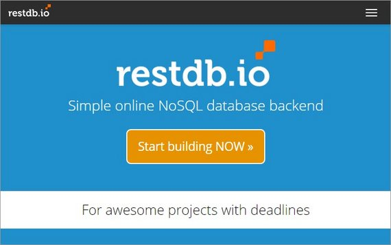](assets/images/4-2.jpg)
**Figure 2:** restdb.io

Right from the homepage it became clear that this product had the features I needed and was straight-forward enough for me to get up and running quickly.

> [restdb.io](https://restdb.io/) is probably the easiest online NoSQL database backend for web and serverless applications.
> - **Simple to use**<br>
>   - model your information quickly.
>   - add data with the data management application
>   - schema and REST API are instantly available.
> - **Developer friendly**<br>
>   - online database tool is designed for the modern web
>   - high performance REST API
>   - NoSQL MongoDB query language
>   - server-side codehooks
>   - secure Ajax/CORS.

This Database-as-a-Service (DBaaS) offering was great in that it simply offered the DB back end along with a management panel and REST API without forcing me to worry about:

- provisioning resources
- server time
- bandwidth
- etc.

It stripped away all of the unnecessary stuff that many of the big cloud companies require you to manage. It just offers some basic, simple services with straight-forward pricing.

The other great thing is that I can start with a Development account for free. This allows me to do the following

- 1 dev/editor user
- 2,500 records
- Max 1 API-call/sec
- DB up to 1Mb file size
- unlimited DBs
- codehooks & jobs available

The last thing that made using this service a joy is that the management panel UI is intuitive and the documentation is simple and easy to follow.

### 2.2 Create DB & Collection
The first thing to do was create the DB.

[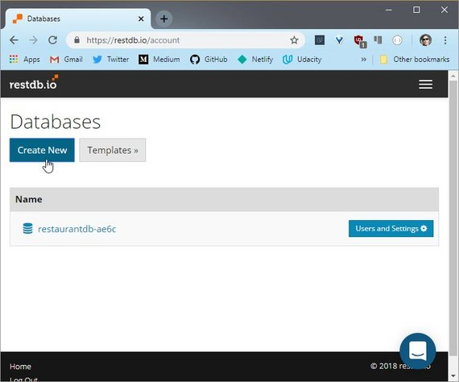](assets/images/4-4.jpg)
**Figure 3:** Create New Database

Once the database is created we can Add a Collection. A collection is the equivalent of a table or spreadsheet.

[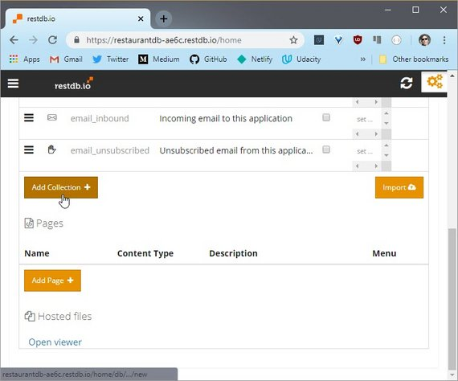](assets/images/4-5.jpg)
**Figure 4:** Add Collection

We name the collection, give it a description, and choose an icon.

[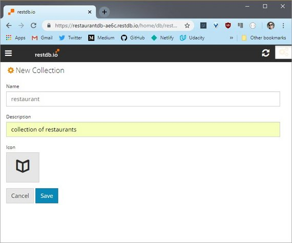](assets/images/4-6.jpg)
**Figure 5:** Collection Info

### 2.3 Define Collection Fields
Next we're taken to the collection detail page where we can define the fields of that collection.

#### Restaurants
Here I defined my restaurant fields.

[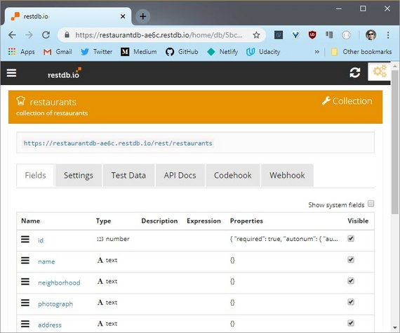](assets/images/4-7.jpg)
**Figure 6:** Collection Fields

From here we can add fields

[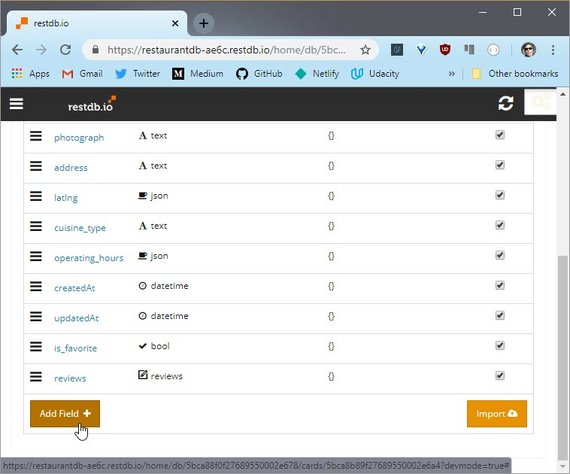](assets/images/4-8.jpg)
**Figure 7:** Add Field

This is were we can define the field type and apply any other constraints we'd like.

[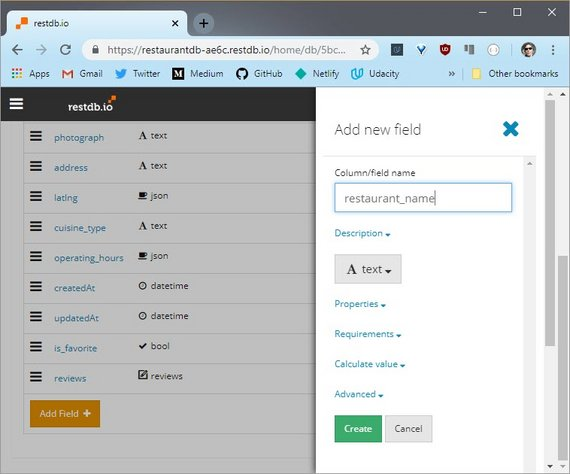](assets/images/4-9.jpg)
**Figure 8:** Define Field

Here are the fields I created for my `restaurants` collection

[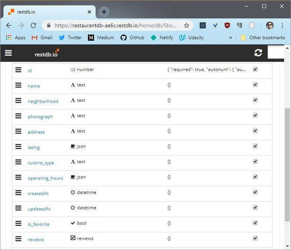](assets/images/4-10.jpg)
**Figure 9:** Restaurants Schema

One thing to note is the last field is a parent-child relation that I defined between restaurants and reviews. It allows a resturant to have many review child records associated.

#### Reviews
Here's the schema I created for the `reviews` collections.

[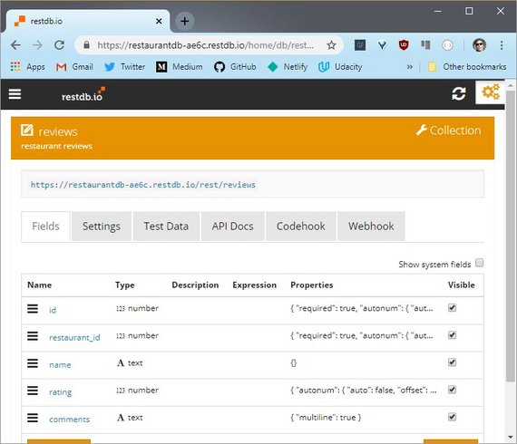](assets/images/4-11.jpg)
**Figure 10:** Reviews Schema

### 2.4 Add Data
#### Restaurants collection
Next I added the data for each restaurant.

[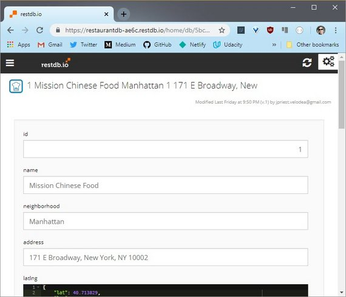](assets/images/4-12.jpg)
**Figure 11:** Add Restaurant Data

Once I was done the collection looked like this.

[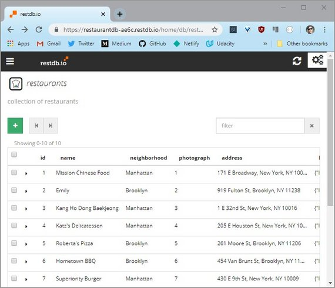](assets/images/4-13.jpg)
**Figure 12:** Restaurants data

#### Reviews collection
The next thing I did was add reviews records

[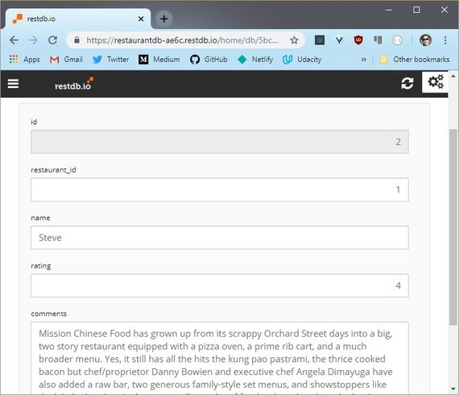](assets/images/4-14.jpg)
**Figure 13:** Add Reviews Data

Once the Reviews collection was complete it looked like this.

[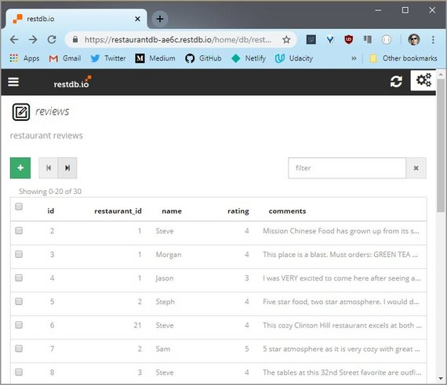](assets/images/4-15.jpg)
**Figure 14:** Reviews data

#### Parent-Child Relation
Since we defined that relationship in the Restaurant schema we can now view and add review records while browsing restaurants.

[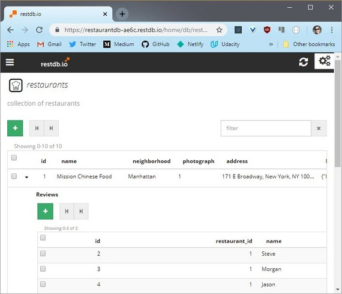](assets/images/4-16.jpg)
**Figure 15:** Parent-Child Relation

## 3. Test REST API
What we need to do is identify each API endpoint being used and figure out what the equivalent call would be to our hosted DB solution.

### 3.1 Old API Endpoints
First thing is to identify the endpoints currently being used to connect to the Stage-3 localhost server.

#### GET Endpoints
- Get all restaurants
  - `http://localhost:1337/restaurants/`
- Get all reviews for a restaurant
  - `http://localhost:1337/reviews/?restaurant_id=<restaurant_id>`

#### POST Endpoints
- Create a new restaurant review
  - `http://localhost:1337/reviews/`
  - Parameters
  ```bash
  {
      "restaurant_id": <restaurant_id>,
      "name": <reviewer_name>,
      "rating": <rating>,
      "comments": <comment_text>
  }
  ```

#### PUT Endpoints
- Favorite a restaurant
  - `http://localhost:1337/restaurants/<restaurant_id>/?is_favorite=true`
- Unfavorite a restaurant
  - `http://localhost:1337/restaurants/<restaurant_id>/?is_favorite=false`

### 3.2 Test with Postman
This is where using an app like Postman really benefits and streamlines development.

The advantage of an app like this is

1. You don't need to write complex code in the console to make it work.
2. Requests can be grouped into collections
3. The response is color coded and easier to read than browser output.

### 3.3 Old API Requests
The first thing I did was create a collection to group all my old API requests made to the stage-3 localhost DB server.

[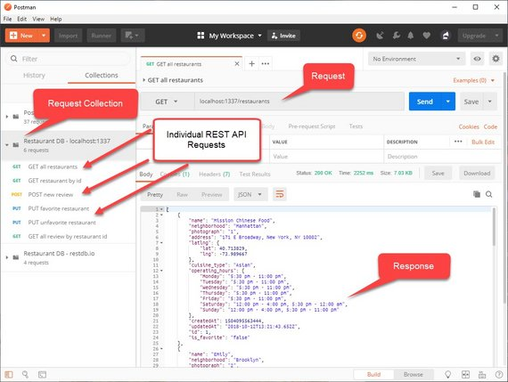](assets/images/4-17.jpg)
**Figure 16:** Postman Old API Collection

### 3.4 New API Requests
The next step in the process was to create the equivalent REST API call to my new data source and ensure it worked properly.

[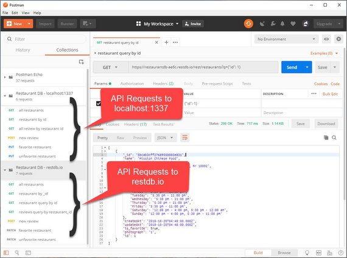](assets/images/4-18.jpg)
**Figure 17:** Postman New API Collection
