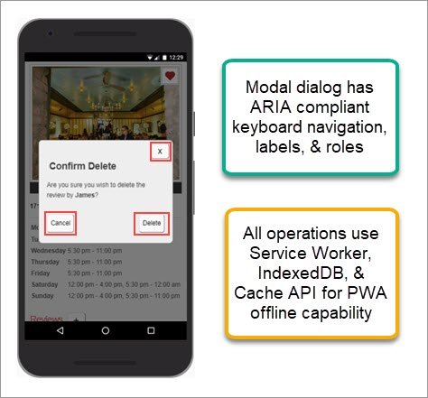
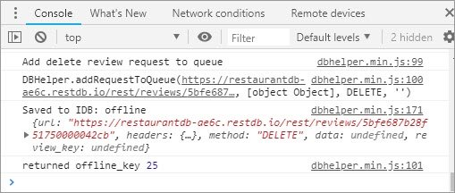
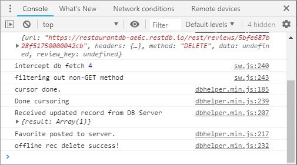
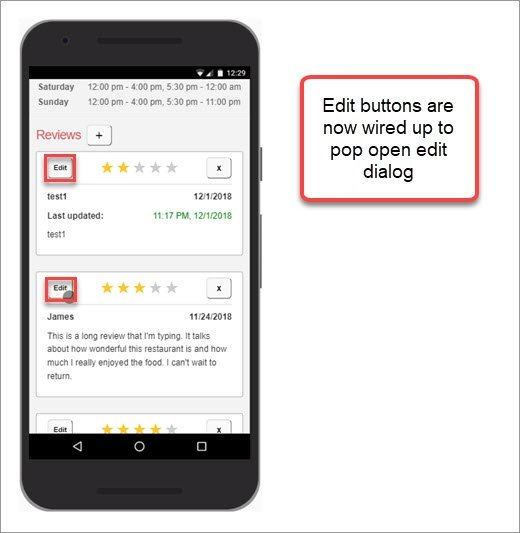
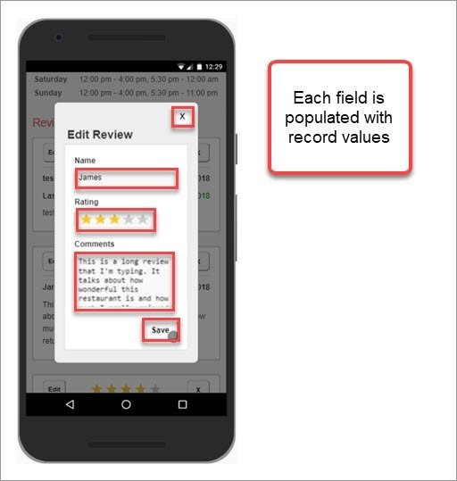

<!-- markdownlint-disable MD022 MD032 -->
# Code Notes

[<-- back to Restaurant Review Code Notes homepage](index.html)

---

### Requirements
The nanodegree only had three stages to complete in order to meet all requirements. 

I'm adding a fourth stage which will include necessary changes to properly host this app as part of my online portfolio.

In order to do this there are a few things that need to happen. I need to:

1. Set up a NoSQL DB to contain the restaurant data
2. Create a RESTful API to perform operations against the DB
3. Make any necessary changes to the client app so it uses the new API.

Items one and two really fall under the realm of back end services and back end programming but I figured this was a good full-stack exercise.

Requirements so far:
- Create a hosted DB instance (NoSQL)
- Import all existing data to new DB
- Setup a backend REST server
- Expose RESTful end points (approximating the old API as closely as possible)
- Update `dbhelper.js` to use new DB source
- Update fetch handlers to work with any changes in the DB model (if necessary)
- Modify Service Worker to properly handle requests to new data source
- Modify IndexedDB code to correctly handle any changes to data schema
- Add DELETE capability to the `reviews` data
- Add EDIT capability (if time permits) to the `reviews` data
- Ensure Lighthouse performance benchmarks still meet the following:
  - **Progressive Web App** - 90 or better
  - **Performance** - 90 or better
  - **Accessibility** - 90 or better

## 1. Back End Data Services
What I need in a nutshell is a NoSQL DB that exposes a set of RESTful APIs for CRUD (Create, Read, Update, & Delete) operations.

### 1.1 NoSQL Databases
The first thing I did was look into some NoSQL solutions. What I focused on was

- [MongoDB](https://www.mongodb.com/nosql-explained) - an open-source NoSQL document-oriented database solution
- [CouchDB](http://couchdb.apache.org/) - an open-source NoSQL document object store with strong sync and HTTP API
- [PouchDB](https://pouchdb.com/guides/) - a local JavaScript implementation of CouchDB that syncs to remote a CouchDB or CouchDB variant (e.g. Cloudant)

There were many, many others but this was a good start.

While PouchDB sounds great for my next offline project, it requires me to integrate and code against the PouchDB js library in my client app.

Maybe that'll be a stage 5 rollout but for now I'd like to refactor my client code as little as possible.

So what I found was great in concept but these are server-based solutions that still needed to be hosted somewhere. 

I did not want to take on the cost of spinning up a VM in order to host this so I decided to look into [Database-as-a-Service (DBaaS)](https://www.g2crowd.com/categories/database-as-a-service-dbaas) hosted solutions.

### 1.2 Cloud Services Defined
Let me first define two ends of a broad spectrum with regards to ways of providing a software solution.

1. On-premises using your own equipment, infrastructure, & software
2. Fully hosted Software-as-a-Service (SaaS) where you pay a monthly fee to utilize a pre-built software solution.

Prior to cloud computing, these were the two primary ways to provide software solutions to your clients.

Now we have a broad range of services that fall somewhere on the spectrum between these two extremes.

[](assets/images/4-1.jpg)
**Figure 1:** On-Premises, Iaas, Paas, Saas

Starting with the lowest level of service and abstraction...

- [IaaS (Infractructure-as-a-Service)](https://www.g2crowd.com/categories/infrastructure-as-a-service-iaas) - allows users to outsource computing infrastructure including servers, storage, networking & VMs.
  - Amazon EC2, Google Compute Engine, Digital Ocean, Azure VMs
- [PaaS (Platform-as-a-Service)](https://www.g2crowd.com/categories/cloud-platform-as-a-service-paas) - provides users with tools to develop, run, and manage web applications.
  - Heroku, Azure Web Apps, Google App Engine, AWS Lambda, Azure Functions, Google Cloud Functions, Salesforce Platform
- [mBaaS (Mobile-Backbone-as-a-Service)](https://www.g2crowd.com/categories/mobile-backend-as-a-service-mbaas) - provides cloud computing architecture for mobile applications, giving developers the ability to connect their app to cloud storage and APIs.
  - Heroku, AWS Mobile Hub, Google Firebase, Parse, built.io Backend, Parse, MongoDB Stitch, Rackspace Managed Cloud
- [DBaaS (Database-as-a-Service)](https://www.g2crowd.com/categories/database-as-a-service-dbaas) - provides prebuilt database backend infrastructure for mobile and web applications. Can include relational or NoSQL (key/value, document, graph, etc.).
  - MongoDB Atlas, Amazon RDS, Amazon DynamoDB, AWS SimpleDB, Azure Tables, Azure DocumentDB, Azure Cosmos, Azure SQL DB, Google Datastore, Google Cloud SQL
- [SaaS (Software-as-a-Service)](https://azure.microsoft.com/en-us/overview/what-is-saas/) - Provides a straight browser-based software solution. These are paid and free app services.
  - Google Apps, Salesforce, DropBox, Constant Contact, etc.

### 1.3 Hosted DB Solutions
Seeing as I only need a DB solution that exposes a REST API, this narrowed my search.

Still, there are many offered solutions though, including:

- AWS (Amazon) - [Amazon SimpleDB](https://aws.amazon.com/simpledb/) and [Amazon DynamoDB](https://aws.amazon.com/dynamodb/)
- Azure (Microsoft) - [Azure Tables](https://azure.microsoft.com/en-us/services/storage/tables/) and [Azure CosmosDB](https://azure.microsoft.com/en-us/services/cosmos-db/)
- Google - [Cloud Firestore](https://cloud.google.com/firestore/) and [Firebase Realtime Database](https://firebase.google.com/products/realtime-database/)
- Cloudant (IBM's hosted CouchDB) - [Cloudant Lite](https://www.ibm.com/cloud/cloudant/pricing) and [PouchDB Client Library](https://pouchdb.com/)

See [NoSQL Hosted examples on Wikipedia](https://en.wikipedia.org/wiki/NoSQL#Hosted).

These all offer pay as you go service models and require additional setup for REST API access. These are definitely larger scale options than I wanted to invest in.

I looked into FaunaDB which was recommended by Netlify.

- [FaunaDB](https://fauna.com/) - NoSQL DB solution requiring a client library and relies on AWS-style Lamba functions for RESTful API.

Again, I wanted a simple, no-cost solution that offers both NoSQL DB storage and REST API access out-of-the-box if possible.

Here's what I finally decided on:

- [restdb.io](https://restdb.io/) - Simple NoSQL database with data management app, schema builder, and REST API instantly available. Free DEV account with 1 MB size limit.

Perfect! Looks like restdb.io fits the bill.

## 2. Build Database
### 2.1 RestDB.io Features

[](assets/images/4-2.jpg)
**Figure 2:** restdb.io

Right from the homepage it became clear that this product had the features I needed and was straight-forward enough for me to get up and running quickly.

> [restdb.io](https://restdb.io/) is probably the easiest online NoSQL database backend for web and serverless applications.
> - **Simple to use**<br>
>   - model your information quickly.
>   - add data with the data management application
>   - schema and REST API are instantly available.
> - **Developer friendly**<br>
>   - online database tool is designed for the modern web
>   - high performance REST API
>   - NoSQL MongoDB query language
>   - server-side codehooks
>   - secure Ajax/CORS.

This Database-as-a-Service (DBaaS) offering was great in that it simply offered the DB back end along with a management panel and REST API without forcing me to worry about:

- provisioning resources
- server time
- bandwidth
- etc.

It stripped away all of the unnecessary stuff that many of the big cloud companies require you to manage. It just offers some basic, simple services with straight-forward pricing.

The other great thing is that I can start with a Development account for free. This allows me to do the following

- 1 dev/editor user
- 2,500 records
- Max 1 API-call/sec
- DB up to 1Mb file size
- unlimited DBs
- codehooks & jobs available

The last thing that made using this service a joy is that the management panel UI is intuitive and the documentation is simple and easy to follow.

### 2.2 Create DB & Collection
The first thing to do was create the DB.

[](assets/images/4-4.jpg)
**Figure 3:** Create New Database

Once the database is created we can Add a Collection. A collection is the equivalent of a table or spreadsheet.

[](assets/images/4-5.jpg)
**Figure 4:** Add Collection

We name the collection, give it a description, and choose an icon.

[](assets/images/4-6.jpg)
**Figure 5:** Collection Info

### 2.3 Define Collection Fields
Next we're taken to the collection detail page where we can define the fields of that collection.

#### Restaurants
Here I defined my restaurant fields.

[](assets/images/4-7.jpg)
**Figure 6:** Collection Fields

From here we can add fields

[](assets/images/4-8.jpg)
**Figure 7:** Add Field

This is were we can define the field type and apply any other constraints we'd like.

[](assets/images/4-9.jpg)
**Figure 8:** Define Field

Here are the fields I created for my `restaurants` collection

[](assets/images/4-10.jpg)
**Figure 9:** Restaurants Schema

One thing to note is the last field is a parent-child relation that I defined between restaurants and reviews. It allows a resturant to have many review child records associated.

#### Reviews
Here's the schema I created for the `reviews` collections.

[](assets/images/4-11.jpg)
**Figure 10:** Reviews Schema

### 2.4 Add Data
#### Restaurants collection
Next I added the data for each restaurant.

[](assets/images/4-12.jpg)
**Figure 11:** Add Restaurant Data

Once I was done the collection looked like this.

[](assets/images/4-13.jpg)
**Figure 12:** Restaurants data

#### Reviews collection
The next thing I did was add reviews records

[](assets/images/4-14.jpg)
**Figure 13:** Add Reviews Data

Once the Reviews collection was complete it looked like this.

[](assets/images/4-15.jpg)
**Figure 14:** Reviews data

#### Parent-Child Relation
Since we defined that relationship in the Restaurant schema we can now view and add review records while browsing restaurants.

[](assets/images/4-16.jpg)
**Figure 15:** Parent-Child Relation

## 3. Test REST API
What we need to do is identify each API endpoint being used and figure out what the equivalent call would be to our hosted DB solution.

### 3.1 Old API Endpoints
First thing is to identify the endpoints currently being used to connect to the Stage-3 localhost server.

#### GET Endpoints
- Get all restaurants
  - `http://localhost:1337/restaurants/`
- Get all reviews for a restaurant
  - `http://localhost:1337/reviews/?restaurant_id=<restaurant_id>`

#### POST Endpoints
- Create a new restaurant review
  - `http://localhost:1337/reviews/`
  - Parameters
  ```bash
  {
      "restaurant_id": <restaurant_id>,
      "name": <reviewer_name>,
      "rating": <rating>,
      "comments": <comment_text>
  }
  ```

#### PUT Endpoints
- Favorite a restaurant
  - `http://localhost:1337/restaurants/<restaurant_id>/?is_favorite=true`
- Unfavorite a restaurant
  - `http://localhost:1337/restaurants/<restaurant_id>/?is_favorite=false`

### 3.2 Test with Postman
This is where using an app like Postman really benefits and streamlines development.

The advantage of an app like this is

1. You don't need to write complex code in the console to make it work.
2. Requests can be grouped into collections
3. The response is color coded and easier to read than browser output.

### 3.3 Old API Requests
The first thing I did was create a collection to group all my old API requests made to the stage-3 localhost DB server.

[](assets/images/4-17.jpg)
**Figure 16:** Postman Old API Collection

### 3.4 New API Requests
The next step in the process was to create the equivalent REST API call to my new data source and ensure it worked properly.

[](assets/images/4-18.jpg)
**Figure 17:** Postman New API Collection

### 3.5 New API Endpoints
Now that I've created and tested each of the necessary HTTP requests in Postman, I can list them out here.

All endpoints require the following headers. These headers specify the type of content we're sending and provide an api key for secure access.

- headers:
  - x-apikey: `<CORS API key>`
  - Content-type : application/json
  - Cache-Control: no-cache

Here are the updated endpoints.

#### GET Endpoints
- Get all restaurants
  - url: `https://restaurantdb-ae6c.restdb.io/rest/restaurants`
- Get all reviews for a restaurant
  - url: `https://restaurantdb-ae6c.restdb.io/rest/reviews?`
  - params: `q={"restaurant_id": 1}`

#### POST Endpoints
- Create a new restaurant review
  - url: `https://restaurantdb-ae6c.restdb.io/rest/reviews`
  - body:
  ```bash
  {
      "restaurant_id": <restaurant_id>,
      "name": <reviewer_name>,
      "rating": <rating>,
      "comments": <comment_text>
  }
  ```

#### PATCH Endpoints
- Favorite a restaurant
  - url: `https://restaurantdb-ae6c.restdb.io/rest/restaurants/<_id>`
  - body:
  ```bash
  {
      "is_favorite": true
  }
  ```
- Unfavorite a restaurant
  - url: `https://restaurantdb-ae6c.restdb.io/rest/restaurants/<_id>`
  - body:
  ```bash
  {
      "is_favorite": false
  }
  ```

## 4. GET Restaurants
Next we look at making any updates necessary to connect to our new data source.

### 4.1 Service Worker Update
The first change we need to make is to our Service Worker. Right now I'm intercepting all Ajax call so I can return a cache value if we have it.

This needs to be updated to filter any requests to the new SB source.

#### sw.js

```js
self.addEventListener('fetch', event => {
  const request = event.request;
  const requestUrl = new URL(request.url);
  
  // 1. filter Ajax Requests
  // if (requestUrl.port === '1337') {  // <- old
  if (requestUrl.host.includes('restaurantdb-ae6c.restdb.io')) {  // <- new
    // more code...
  }
});
```

### 4.2 Database URL Update
The next change is to the database connection string.

#### dbhelper.js

```js
static get DATABASE_URL() {
  // const port = 1337; // Change this to your server port  // <- old
  // return `http://localhost:${port}`;                     // <- old
  return 'https://restaurantdb-ae6c.restdb.io/rest';       // <- new
}
```

We also need to create a new static method that will append a set of required headers to each and every request.

```js
static get DB_HEADERS() {
  return {
    'x-apikey': '<CORS API key>',
    'Content-Type': 'application/json',
    'Cache-Control': 'no-cache'
  };
}
```

### 4.3 Update Fetch Restaurants
Now that we have the DB host URL and headers updated it's time to update our first endpoint.

This is responsible for pulling down the list of restaurants from which the index page is built.

#### dbhelper.js

```js
static fetchRestaurants(callback) {
  fetch(DBHelper.DATABASE_URL + '/restaurants', { // <- new
    headers: DBHelper.DB_HEADERS                  // <- new
  })                                              // <- new
    .then(response => {
      if (!response.ok) {
        throw Error(`Request failed. Returned status: ${response.statusText}`);
      }
      const restaurants = response.json();
      return restaurants;
    })
    .then(restaurants => callback(null, restaurants))
    .catch(err => callback(err, null));
}
```

The code also kicks off the process of writing each record to our local IDB `restaurants` object store.

[](assets/images/4-19.jpg)
**Figure 18:** New IDB Data

## 5. GET Reviews
### 5.1 Update Fetch Reviews
The next thing we want to update is the `fetchRestaurantReviewsById` method.

This gets invoked on each restaurant's detail page and pulls down just that restaurant's reviews.

#### dbhelper.js

```js
static fetchRestaurantReviewsById(id, callback) {
  const url = `${DBHelper.DATABASE_URL}/reviews?q={"restaurant_id": ${id}}`;
  fetch(url, {
    headers: DBHelper.DB_HEADERS
  })
    .then(response => response.json())
    .then(data => callback(null, data))
    .catch(err => callback(err, null));
}
```

The `url` has been updated and fetch now includes the proper headers.

### 5.2 Update Service Worker
The next thing to do is update the Service Worker to properly grab `restaurant_id` from the QueryString fetch request to the database.

The fetch URL is different now so we need to modify the code below. Once we have the `restaurant_id` we can call `idbReviewResponse` to query & return data from our local IDB so we don't make unnecessary fetch requests.

#### sw.js 

```js
self.addEventListener('fetch', event => {
  const request = event.request;
  const requestUrl = new URL(request.url);
  
  // 1. filter Ajax Requests
  if (requestUrl.host.includes('restaurantdb-ae6c.restdb.io')) {
    // 2. Only cache GET methods
    if (event.request.method !== 'GET') {
      console.log('filtering out non-GET method');
      return;
    }

    console.log('fetch intercept', ++i, requestUrl.href);

    if (request.url.includes('reviews')) {
      const qObj = JSON.parse(requestUrl.searchParams.get('q'));  // <- new
      const id = +qObj.restaurant_id;                             // <- new
      event.respondWith(idbReviewResponse(request, id));
    } else {
      event.respondWith(idbRestaurantResponse(request));
    }
  }
  // more code...
});
```

### 5.3 Restaurant Detail Page
Next I navigate to one of the restaurant detail pages to test that the data is coming through properly.

[](assets/images/4-20.jpg)
**Figure 19:** New Review Data

I see the page displays restaurant reviews and I see review records in the reviews store under IndexedDB.

## 6. Delete & Edit Buttons
### 6.1 Button Code
The first thing I did was to create the button code in my detail page.

#### restaurant_info.js

```js
const createReviewHTML = (review, i) => {
  const li = document.createElement('li');
  const ctrlDiv = document.createElement('div');
  ctrlDiv.classList.add('ctrl-div');

  const editBtn = document.createElement('button');
  editBtn.id = 'review-edit-btn' + i;
  editBtn.classList.add('review_btn');
  editBtn.classList.add('review-edit-btn');
  editBtn.dataset.reviewId = review._id;
  editBtn.innerHTML = 'Edit';
  editBtn.setAttribute('aria-label', 'edit review');
  editBtn.title = 'Edit Review';
  editBtn.addEventListener('click', (e) => editRecord(e, review));
  ctrlDiv.appendChild(editBtn);

  const delBtn = document.createElement('button');
  delBtn.id = 'review-del-btn' + i;
  delBtn.classList.add('review_btn');
  delBtn.classList.add('review-del-btn');
  delBtn.dataset.reviewId = review._id;
  delBtn.dataset.restaurantId = review._parent_id;
  delBtn.dataset.reviewName = review.name;
  delBtn.innerHTML = 'x';
  delBtn.setAttribute('aria-label', 'delete review');
  delBtn.title = 'Delete Review';
  delBtn.addEventListener('click', delRecord);
  ctrlDiv.appendChild(delBtn);

  li.appendChild(ctrlDiv);

  // more code...
}
```

This creates both buttons and assigns the record's `review.id` to the button's dataset so it can be retrieved in the click handler.

This is what the stub handlers look like.

```js
const editRecord = (e, review) => {
  const review_id = e.target.dataset.reviewId;
  console.log(review_id);
  console.log(review);
};

const delRecord = (e) => {
  const review_id = e.target.dataset.reviewId;
  console.log(review_id);
};
```

### 6.2 Style Updates
The CSS changes involve styling the various buttons.

```css
.ctrl-div {
  display: flex;
  flex-direction: row;
  justify-content: space-between;
  border-bottom: 1px solid #ccc;
  padding-bottom: 10px;
  margin-bottom: 10px;
}
.review_btn {
  padding: 0;
  min-height: 40px;
  cursor: pointer;
}
#review-edit-btn, #review-del-btn {
  font-weight: bold;

}
#review-add-btn {
  font-size: 1.6em;
}
#review-edit-btn {
  font-size: 0.825em;
}
```

### 6.3 Page Screenshot
Here are the screenshots of the new set of buttons.

[](assets/images/4-21.jpg)
**Figure 20:** Button Screenshot 1

[](assets/images/4-22.jpg)
**Figure 21:** Button Screenshot 2

[](assets/images/4-23.jpg)
**Figure 22:** Button Screenshot 3

## 7. Streamline Database
### 7.1 Eliminate extra DB fields
Some of the fields I manually created ended up being unnecessary. These are fields like primary keys, date created/updated, and foreign key relationships that restdb.io already handles internally. They are known as system fields and are usually preceded by an underscore.

Since this was the case, it was duplicate work on my part to track this information manually.

So the first step was to do away with the following duplicate fields.

- Restaurants
  - restaurants.id
  - restaurants.dateCreated
  - restaurants.dateUpdated

This left me with a streamlined restaurants table.

[](assets/images/4-24.jpg)
**Figure 23:** Restaurants Table

I then got rid of the extra reviews table fields as well.

- Reviews
  - reviews.id
  - reviews.dateCreated
  - reviews.dateUpdated
  - reviews.restaurant_id (foreign key)

This left me with a reduced reviews table.

[](assets/images/4-25.jpg)
**Figure 24:** Reviews Table

### 7.2 DB system fields
The database uses system fields in order to track primary/foreign key relationships as well as date create, date updated, and other fields.

These fields start with an underscore.

Here's a restaurants record.

[](assets/images/4-26.jpg)
**Figure 25:** Restaurants record

Next is a screenshot of a review record with the system fields exposed.

[](assets/images/4-27.jpg)
**Figure 26:** Review Record

### 7.3 Code updates
The next set of changes are to the code in order to reflect the new field names.

First we start with updates to the IDB store.

#### idbhelper.js
This is were the IDB data store is defined. It has to be updated in order to reflect the new keys. `id` becomes `_id` and `restaurant_id` becomes `_parent_id`.

```js
const dbPromise = idb.open('udacity-restaurant-db', 3, upgradeDB => {
  switch (upgradeDB.oldVersion) {
    case 0:
      // upgradeDB.createObjectStore('restaurants',
      //  { keyPath: 'id', unique: true });      <- old
      upgradeDB.createObjectStore('restaurants',
        { keyPath: '_id', unique: true });    // <- new
    case 1:
      const reviewStore = upgradeDB.createObjectStore('reviews',
        { autoIncrement: true });
      // reviewStore.createIndex('restaurant_id', 'restaurant_id');    <- old
      reviewStore.createIndex('restaurant_id', '_parent_id');       // <- new
    case 2:
      upgradeDB.createObjectStore('offline', { autoIncrement: true });
  }
});
self.dbPromise = dbPromise;
```

These changes now produce the following in the browser's IDB database.

[](assets/images/4-28.jpg)
**Figure 27:** Restaurants store

[](assets/images/4-29.jpg)
**Figure 28:** Review store

#### sw.js
`restaurant_id` field now becomes `_parent_id`.

```js
self.addEventListener('fetch', event => {
  const request = event.request;
  const requestUrl = new URL(request.url);
  
  // 1. filter Ajax Requests
  if (requestUrl.host.includes('restaurantdb-ae6c.restdb.io')) {
    // 2. Only cache GET methods
    if (event.request.method !== 'GET') {
      console.log('filtering out non-GET method');
      return;
    }

    console.log('fetch intercept', ++i, requestUrl.href);

    if (request.url.includes('reviews')) {
      const qObj = JSON.parse(requestUrl.searchParams.get('q'));  //<- here
      const id = qObj._parent_id;                                 //<- here
      event.respondWith(idbReviewResponse(request, id));
    } else {
      event.respondWith(idbRestaurantResponse(request));
    }
    // other code
  }
};
```

#### restaurant_info.js
All instances of `restaurant.id` in code become `restaurant._id`.

```js
const fillRestaurantHTML = (restaurant = self.restaurant) => {
  // other code...
  // fill reviews
  DBHelper.fetchRestaurantReviewsById(restaurant._id, fillReviewsHTML); // new
};
```

```js
const createReviewHTML = (review) => {
  // other code...
  editBtn.dataset.reviewId = review._id;  // <- new
  // other code...
  const createdDate = review._created ?
    new Date(review._created).toLocaleDateString() :  // <- new
    'Pending';
  // other code...
  const updatedDate = review._changed ? // <- new
    new Date(review._changed).toLocaleDateString() :
    'Pending';
  // other code...
}
```

#### dbhelper.js
This file is responsible for each of the fetch requests. Most of the changes occur in `url`.

```js
static fetchRestaurants(callback) {
  fetch(DBHelper.DATABASE_URL + '/restaurants?metafields=true', {   // <- new
    headers: DBHelper.DB_HEADERS
  })
    .then(response => {
      if (!response.ok) {
        throw Error(`Request failed. Returned status: ${response.statusText}`);
      }
      const restaurants = response.json();
      return restaurants;
    })
    .then(restaurants => callback(null, restaurants))
    .catch(err => callback(err, null));
}

static fetchRestaurantReviewsById(restaurant_id, callback) {
  const url = `${DBHelper.DATABASE_URL}/reviews?
    q={"_parent_id":"${restaurant_id}"}&metafields=true`;  // <- new

  fetch(url, {
    headers: DBHelper.DB_HEADERS
  })
    .then(response => response.json())
    .then(data => callback(null, data))
    .catch(err => callback(err, null));
}

static fetchRestaurantById(id, callback) {
  // fetch all restaurants with proper error handling.
  DBHelper.fetchRestaurants((error, restaurants) => {
    if (error) {
      callback(error, null);
    } else {
      const restaurant = restaurants.find(r => r._id == id);  // <- new
      if (restaurant) { // Got the restaurant
        callback(null, restaurant);
      } else { // Restaurant does not exist in the database
        callback('Restaurant does not exist', null);
      }
    }
  });
}

static urlForRestaurant(restaurant) {
  return (`./restaurant.html?id=${restaurant._id}`);  // <- new
}

static imageUrlForRestaurant(restaurant) {
  return (`/img/${restaurant.photograph}-300.jpg`); // <- new
}

static imageSrcsetForIndex(restaurant) {
  return (`/img/${restaurant.photograph}-300.jpg 1x,
  /img/${restaurant.photograph}-600_2x.jpg 2x`);  // <- new
}

static imageSrcsetForRestaurant(restaurant) {
  return (`/img/${restaurant.photograph}-300.jpg 300w,
  /img/${restaurant.photograph}-400.jpg 400w,
  /img/${restaurant.photograph}-600_2x.jpg 600w,
  /img/${restaurant.photograph}-800_2x.jpg 800w`);  // <- new
}
```

## 8. Favorite Toggle
### 8.1 Update Fetch
The DB call to update the favorite status uses a `PATCH` method.

The `PATCH` method is used to update a single field within a record.

#### dbhelper.js

```js
static toggleFavorite(restaurant, callback) {
  const is_favorite = JSON.parse(restaurant.is_favorite);
  const id = +restaurant.id;
  const db_id = restaurant._id;
  restaurant.is_favorite = !is_favorite;

  const url = `${DBHelper.DATABASE_URL}/restaurants/${db_id}`;
  const method = 'PATCH';
  const headers = DBHelper.DB_HEADERS;
  const body = JSON.stringify({ "is_favorite": !is_favorite });

  fetch(url, {
    headers: headers,
    method: method,
    body: body
  })
    .then(response => response.json())
    .then(data => callback(null, data))
    .catch(err => {
      // We are offline
      // Update restaurant record in local IDB
      DBHelper.updateIDBRestaurant(restaurant)
        .then(() => {
          // add to queue...
          console.log('Add favorite request to queue');
          console.log(`DBHelper.addRequestToQueue(${url}, ${headers},
            ${method}, ${body})`);
          DBHelper.addRequestToQueue(url, headers, method, body)
            .then(offline_key => console.log('offline_key', offline_key));
        });
      callback(err, null);
    });
}
```

### 8.2 Toggle screenshot
This now allows us to toggle the favorite button from both the main page and the detail page.

[](assets/images/4-30.jpg)
**Figure 29:** Favorite toggle

## 9. POST Review
### 9.1 Update Save & Fetch
This piece of functionality was working with the old data source. So, what we need to do is update the Fetch call.

#### dbhelper.js

```js
static createRestaurantReview(restaurant_id, name, rating, comments, callback) {
  const url = `${DBHelper.DATABASE_URL}/restaurants/${restaurant_id}/reviews`;
  const method = 'POST';  // ^ new ^
  const headers = DBHelper.DB_HEADERS;  // <- new

  const data = {
    name: name,
    rating: +rating,
    comments: comments
  };
  const body = JSON.stringify(data);
  
  fetch(url, {
    headers: headers, // <- new
    method: method,
    body: body
  })
    .then(response => response.json())
    .then(data => callback(null, data))
    .catch(err => {
      // We are offline...
      // Save review to local IDB
      data._parent_id = restaurant_id; // Add this to provide IDB foreign key
      DBHelper.createIDBReview(data)  // ^ new ^
        .then(review_key => {
          // Get review_key and save it with review to offline queue
          console.log('returned review_key', review_key);
          DBHelper.addRequestToQueue(url, headers, method, body, review_key)
            .then(offline_key => console.log('offline_key', offline_key));
        });
      callback(err, null);
    });
}
```

The other thing we need to do is make a small update to the calling function.

#### restaurant_info.js

```js
const saveAddReview = (e) => {
  e.preventDefault();
  const form = e.target;

  if (form.checkValidity()) {
    console.log('is valid');

    const restaurant_id = self.restaurant._id;  // <- here
```

### 9.2 Test Save Review
The next step was to test that everything posted properly.

[](assets/images/4-31.jpg)
**Figure 30:** Add Review Form

[](assets/images/4-32.jpg)
**Figure 31:** Console Result

### 9.3 Fix processQueue()
There are two changes that need to happen in order for POSTS to work properly.

#### dbhelper.js

```js
static processQueue() {
// Open offline queue & return cursor
  dbPromise.then(db => {
    if (!db) return;
    const tx = db.transaction(['offline'], 'readwrite');
    const store = tx.objectStore('offline');
    return store.openCursor();
  })
    .then(function nextRequest (cursor) {
      // console.log('cursor', cursor.value.data.name, cursor.value.data);
      console.log('cursor.value', cursor.value);

      const offline_key = cursor.key;
      const url = cursor.value.url;
      const headers = cursor.value.headers;
      const method = cursor.value.method;
      const data = cursor.value.data;
      const review_key = cursor.value.review_key;
      // const body = data ? JSON.stringify(data) : '';
      const body = data;

      // more code...
```

## 10. Delete Review
### 10.1 Create Confirm Modal
The first thing I did was create the HTML & CSS.

#### restaurant.html

```html
<div id="confirm_delete_modal" class="modal" role="dialog" aria-modal="true"
  aria-labelledby="confirm-delete-header">
  <button class="close-btn" aria-label="close" title="Close">x</button>
  <div class="modal_form_container">
    <h2 id="confirm-delete-header">Confirm Delete</h2>
    <div id="confirm_form">
      <p>Are you sure you wish to delete the review by
        <b id="review_name"></b>?</p>
      <div class="confirm-buttons">
        <div class="fieldset">
          <button id="cancel_btn">Cancel</button>
        </div>
        <div class="fieldset right">
          <button id="delete_confirm_btn">Delete</button>
        </div>
      </div>
    </div>
  </div>
</div>
```

Most of the modal css was already written for the review input form but I needed re-use this css for my delete review modal.

To do this I needed to turn some existing id's into classes. The style rules remained the same.

- `#modal` -> `.modal`
- `#modal.show` -> `.show`
- `#modal .close-btn` -> `.modal > .close-btn`
- `#review_form_container` -> `.modal_form_container`
- `#review_form_container h2` -> `.modal_form_container h2`

Next I created the minimal style for the confirm modal.

#### styles.css

```css
#confirm_form {
  width: 300px;
}
.confirm-buttons {
  display: flex;
  justify-content: space-between;
}
```

### 10.2 Refactor Modal Code
Next I needed to take the code written for the "Add new review" pop-up (modal) and make it available for the "Confirm delete" modal.

There were a few functions that got renamed and refactored.

- `openModal()` -> `wireUpModal()`
- `closeModal()` -> `closeAddReviewModal()`

I added the following.

- `openAddReviewModal()`
- `openConfirmDeleteModal()`
- `closeConfirmDeleteModal()`

#### restaurant_info.js
This is the open modal code for both forms.

```js
const openAddReviewModal = () => {
  const modal = document.getElementById('add_review_modal');
  wireUpModal(modal, closeAddReviewModal);

  // submit form
  const form = document.getElementById('review_form');
  form.addEventListener('submit', addReview, false);
};

const openConfirmDeleteModal = (e) => {
  const modal = document.getElementById('confirm_delete_modal');
  wireUpModal(modal, closeConfirmDeleteModal);

  const nameContainer = document.getElementById('review_name'); 
  nameContainer.textContent = e.target.dataset.reviewName;

  const cancelBtn = document.getElementById('cancel_btn');
  cancelBtn.onclick = closeConfirmDeleteModal;

  const delConfirmBtn = document.getElementById('delete_confirm_btn');
  delConfirmBtn.dataset.reviewId = e.target.dataset.reviewId;
  delConfirmBtn.dataset.restaurantId = e.target.dataset.restaurantId;

  delConfirmBtn.onclick = delReview;
};
```

Here's the close modal code for both forms.

```js
const closeConfirmDeleteModal = () => {
  const modal = document.getElementById('confirm_delete_modal');
  // Hide the modal and overlay
  modal.classList.remove('show');
  modalOverlay.classList.remove('show');

  // Set focus back to element that had it before the modal was opened
  focusedElementBeforeModal.focus();
};

const closeAddReviewModal = () => {
  const modal = document.getElementById('add_review_modal');
  // Hide the modal and overlay
  modal.classList.remove('show');
  modalOverlay.classList.remove('show');

  const form = document.getElementById('review_form');
  form.reset();
  // Set focus back to element that had it before the modal was opened
  focusedElementBeforeModal.focus();
};
```

This is the new `wireUpModal` method to create an ARIA compliant and keyboard navigatable modal dialog.

```js
const wireUpModal = (modal, closeModal) => {
  // Save current focus
  focusedElementBeforeModal = document.activeElement;

  // Listen for and trap the keyboard
  modal.addEventListener('keydown', trapTabKey);

  // Listen for indicators to close the modal
  modalOverlay.addEventListener('click', closeModal);
  // Close btn
  let closeBtns = document.querySelectorAll('.close-btn');
  // closeBtn.addEventListener('click', closeModal);
  closeBtns = Array.prototype.slice.call(closeBtns);
  closeBtns.forEach(btn => btn.addEventListener('click', closeModal));

  // Find all focusable children
  var focusableElementsString = 'a[href], area[href], input:not([disabled]),' +
    'select:not([disabled]), textarea:not([disabled]), button:not([disabled]),' +
    'iframe, object, embed, [tabindex="0"], [contenteditable]';
  var focusableElements = modal.querySelectorAll(focusableElementsString);
  // Convert NodeList to Array
  focusableElements = Array.prototype.slice.call(focusableElements);

  var firstTabStop = focusableElements[0];
  var lastTabStop = focusableElements[focusableElements.length - 1];

  // Show the modal and overlay
  modal.classList.add('show');
  modalOverlay.classList.add('show');

  // Focus second child
  setTimeout(() => {
    firstTabStop.focus();
    focusableElements[1].focus();
  }, 200);

  function trapTabKey(e) {
    // Check for TAB key press
    if (e.keyCode === 9) {

      // SHIFT + TAB
      if (e.shiftKey) {
        if (document.activeElement === firstTabStop) {
          e.preventDefault();
          lastTabStop.focus();
        }

      // TAB
      } else {
        if (document.activeElement === lastTabStop) {
          e.preventDefault();
          firstTabStop.focus();
        }
      }
    }

    // ESCAPE
    if (e.keyCode === 27) {
      closeModal();
    }
  }
};
```

### 10.3 Delete & DB Code
Next is the code that actually deletes the review.

#### restaurant_info.js

```js
const delReview = (e) => {
  const review_id = e.target.dataset.reviewId;
  const restaurant_id = e.target.dataset.restaurantId;
  console.log(review_id);

  DBHelper.deleteRestaurantReview(review_id, restaurant_id, (error, result) => {
    console.log('got delete callback');
    if (error) {
      showOffline();
    } else {
      console.log(result);
      DBHelper.delIDBReview(review_id, restaurant_id);
    }
    // update idb
    idbKeyVal.getAllIdx('reviews', 'restaurant_id', restaurant_id)
      .then(reviews => {
        // console.log(reviews);
        fillReviewsHTML(null, reviews);
        closeConfirmDeleteModal();
        document.getElementById('review-add-btn').focus();
      });
  });
};
```

#### dbhelper.js

```js
static deleteRestaurantReview(review_id, restaurant_id, callback) {
  const url = `https://restaurantdb-ae6c.restdb.io/rest/reviews/${review_id}`;
  const method = 'DELETE';
  const headers = DBHelper.DB_HEADERS;

  fetch(url, {
    headers: headers,
    method: method
  })
    .then(response => response.json())
    .then(data => callback(null, data))
    .catch(err => {
      // We are offline...
      // Delete from  local IDB
      console.log('what err:', err);
      DBHelper.delIDBReview(review_id, restaurant_id)
        .then(() => {
          // add request to queue
          console.log('Add delete review request to queue');
          console.log(`DBHelper.addRequestToQueue(${url}, ${headers},
            ${method}, '')`);
          DBHelper.addRequestToQueue(url, headers, method)
            .then(offline_key => console.log('offline_key', offline_key));
          // console.log('implement offline for delete review');
        });
      callback(err, null);
    });
}
```

```js
static delIDBReview(review_id, restaurant_id) {
  return idbKeyVal.openCursorIdxByKey('reviews', 'restaurant_id', restaurant_id)
    .then(function nextCursor(cursor) {
      if (!cursor) return;
      console.log(cursor.value.name);
      if (cursor.value._id === review_id) {
        console.log('we matched');
        cursor.delete();
        return;
      }
      return cursor.continue().then(nextCursor);
    });
}
```

#### idbhelper.js

```js
  openCursorIdxByKey(store, idx, key) {
    return dbPromise.then(db => {
      return db.transaction(store, 'readwrite')
        .objectStore(store)
        .index(idx)
        .openCursor(key);
    });
  }
```

### 10.4 Confirm Dialog
Here's a screenshot of the confirm dialog.

[](assets/images/4-33.jpg)
**Figure 32:** Delete Dialog

It works online and offline.

If the app is offline the request is saved locally and sent once the connection is re-established. Any changes are also reflected locally immediately.

[](assets/images/4-34.jpg)
**Figure 33:** Offline Notice

The record appears in the local IDB data store.

[](assets/images/4-35.jpg)
**Figure 34:** Offline request

Here's the Console output confirming the operation.

[](assets/images/4-36.jpg)
**Figure 35:** Offline Confirmation

Once we go online again we have the Console output confirm the delete operation.

[](assets/images/4-37.jpg)
**Figure 36:** Offline Confirmation

## 11. Edit Review
### 11.1 Wire up Edit Button
The first thing is to attach a new event handler to the edit button.

#### restaurant_info.js

```js
const createReviewHTML = (review, i) => {
  const li = document.createElement('li');
  const ctrlDiv = document.createElement('div');
  ctrlDiv.classList.add('ctrl-div');

  const editBtn = document.createElement('button');
  editBtn.id = 'review-edit-btn' + i;
  editBtn.classList.add('review_btn');
  editBtn.classList.add('review-edit-btn');
  editBtn.dataset.reviewId = review._id;
  editBtn.innerHTML = 'Edit';
  editBtn.setAttribute('aria-label', 'edit review');
  editBtn.title = 'Edit Review';
  editBtn.addEventListener('click',         // <- here
    (e) => openEditReviewModal(e, review)); // <- here
  ctrlDiv.appendChild(editBtn);
  // ...
```

### 11.2 Edit Review Modal
Event handler we just wired up will open the input form with the fields pre-populated.

#### restaurant_info.js

```js
const openEditReviewModal = (e, review) => {
  const modal = document.getElementById('add_review_modal');
  wireUpModal(modal, closeAddReviewModal);
  
  document.getElementById('add-review-header').innerText = 'Edit Review';
  
  document.querySelector('#reviewName').value = review.name;
  switch (review.rating) {
    case 1:
      document.getElementById('star1').checked = true;
      break;
    case 2:
      document.getElementById('star2').checked = true;
      break;
    case 3:
      document.getElementById('star3').checked = true;
      break;
    case 4:
      document.getElementById('star4').checked = true;
      break;
    case 5:
      document.getElementById('star5').checked = true;
      break;
  }
  document.querySelector('#reviewComments').value = review.comments;
  
  const review_id = e.target.dataset.reviewId;

  // submit form
  const form = document.getElementById('review_form');
  form.addEventListener('submit', (e) => editReview(e, review), false);  
};
```

This also wires up the submit button to the `editReview` handler.

### 11.3 Update Review
The handler makes sure the form is valid and then attempts to save to the database.

#### restaurant_info.js

```js
const editReview = (e, review) => {
  e.preventDefault();
  const form = e.target;

  if (form.checkValidity()) {
    const review_id = review._id;
    const restaurant_id = self.restaurant._id;
    const name = document.querySelector('#reviewName').value;
    const rating = document.querySelector('input[name=rate]:checked').value;
    const comments = document.querySelector('#reviewComments').value;

    // attempt save to database server
    DBHelper.updateRestaurantReview(review_id, restaurant_id, name, rating,
      comments, (error, review) => {
      console.log('got update callback');
      form.reset();
      if (error) {
        console.log('We are offline. Review has been saved to the queue.');
        showOffline();
      } else {
        console.log('Received updated record from DB Server', review);
        DBHelper.updateIDBReview(review_id, restaurant_id, review);
      }
      idbKeyVal.getAllIdx('reviews', 'restaurant_id', restaurant_id)
        .then(reviews => {
          console.log('new review', reviews);
          fillReviewsHTML(null, reviews);
          closeEditReviewModal();
        });
    });
  }
};
```

### 11.4 Database Code
This method formats the data and makes the fetch request to update the record. If the request fails it save the request to the queue.

#### dbhelper.js

```js
static updateRestaurantReview(review_id, restaurant_id, name, rating,
  comments, callback) {
  const url = `${DBHelper.DATABASE_URL}/reviews/${review_id}`;
  const method = 'PUT';
  const headers = DBHelper.DB_HEADERS;

  const data = {
    name: name,
    rating: +rating,
    comments: comments
  };
  const body = JSON.stringify(data);
  
  fetch(url, {
    headers: headers,
    method: method,
    body: body
  })
    .then(response => response.json())
    .then(data => callback(null, data))
    .catch(err => {
      // We are offline...
      // Save review to local IDB
      data._id = review_id;
      data._parent_id = restaurant_id; // Add this to provide IDB foreign key
      DBHelper.updateIDBReview(review_id, restaurant_id, review)
        .then(() => {
          // Get review_key and save it with review to offline queue
          console.log('Add update review to queue');
          DBHelper.addRequestToQueue(url, headers, method, body)
            .then(offline_key => console.log('offline_key', offline_key));
        });
      callback(err, null);
    });
}
```

The `updateIDBReview` method loops through the local IDB reviews until it finds the record we're updating. It then updates the fields and calls `cursor.update`.

```js
static updateIDBReview(review_id, restaurant_id, review) {
  return idbKeyVal.openCursorIdxByKey('reviews', 'restaurant_id', restaurant_id)
    .then(function nextCursor(cursor) {
      if (!cursor) return;
      var updateData = cursor.value;
      console.log(cursor.value.name);
      if (cursor.value._id === review_id) {
        console.log('we matched');

        updateData.name = review.name;
        updateData.rating = review.rating;
        updateData.comments = review.comments;
        updateData._changed = review._changed;
        cursor.update(updateData);
        return;
      }
      return cursor.continue().then(nextCursor);
    });
}
```

### 11.5 Close Edit Modal
The last step is to close the modal and give focus back to the last element that had focus.

#### restaurant_info.js

```js
const closeEditReviewModal = () => {
  const modal = document.getElementById('add_review_modal');
  // Hide the modal and overlay
  modal.classList.remove('show');
  modalOverlay.classList.remove('show');

  const form = document.getElementById('review_form');
  form.reset();
  form.removeEventListener('submit', editReview);

  // Set focus back to element that had it before the modal was opened
  focusedElementBeforeModal.focus();
};
```

### 11.6 Edit Dialog
Here's what the dialog looks like now that it's hooked up.

[](assets/images/4-38.jpg)
**Figure 37:** Edit Record Buttons

[](assets/images/4-39.jpg)
**Figure 38:** Edit Review